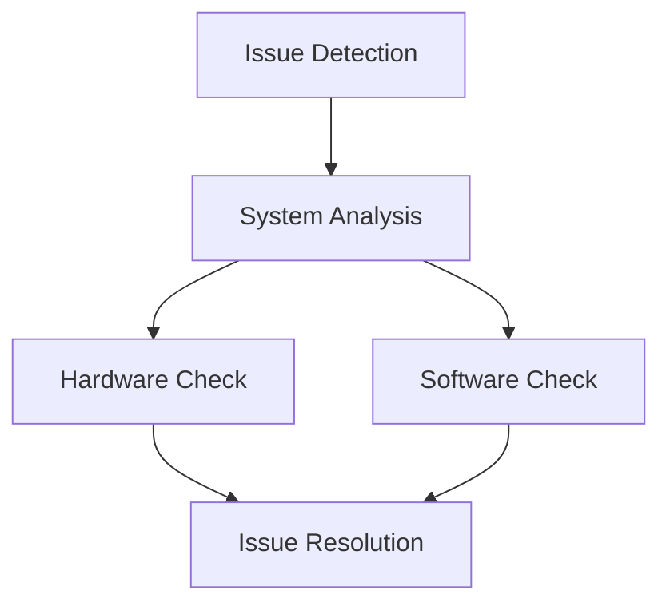

# Advanced Troubleshooting

Comprehensive guide for resolving complex issues in local LLM deployments.

## Difficulty Level
Advanced

## Estimated Reading Time
30 minutes

{: .note }
This guide covers advanced troubleshooting techniques. For basic issues, refer to [Basic Troubleshooting](../quick-start/troubleshooting.md).

## Prerequisites
- [Basic Troubleshooting](../quick-start/troubleshooting.md)
- [Hardware Optimization](hardware-optimization.md)
- [Model Tuning](model-tuning.md)

## Topics Covered
- System diagnostics
- Performance analysis
- Memory management
- Error resolution
- Prevention strategies

## Diagnostic Flow



## System Diagnostics

{: .content-card }
### Diagnostic Tools
```python
def diagnose_system():
    """
    Comprehensive system diagnostic routine
    """
    # Check hardware status
    check_gpu_health()
    verify_memory_allocation()
    test_disk_performance()
    
    # Verify software configuration
    validate_cuda_setup()
    check_python_environment()
    verify_model_integrity()
    
    # Analyze performance metrics
    measure_inference_speed()
    monitor_memory_usage()
    track_response_times()
```

## Complex Issue Resolution

{: .content-card }
### Memory Management Issues
1. VRAM Exhaustion
   - Identify memory leaks
   - Optimize tensor operations
   - Implement gradient checkpointing
   - Configure proper cleanup routines

2. System RAM Depletion
   - Monitor swap usage
   - Optimize cache settings
   - Configure memory limits
   - Implement proper cleanup

3. Swap Space Issues
   - Adjust swap settings
   - Monitor page faults
   - Optimize memory pressure
   - Configure swappiness

{: .tip }
Use tools like `nvidia-smi` with watch command to monitor VRAM usage in real-time: `watch -n 0.5 nvidia-smi`

## Performance Analysis

### Model Performance Issues
1. Response Degradation
   ```python
   def analyze_performance():
       # Monitor response times
       # Track token generation speed
       # Analyze memory patterns
       # Log system metrics
   ```

2. Loading Failures
   - Verify model checksums
   - Check file permissions
   - Validate configuration
   - Test disk performance

3. Quantization Issues
   - Validate quantization settings
   - Check precision requirements
   - Monitor accuracy metrics
   - Test different formats

## Advanced Debugging

{: .content-card }
### Debug Commands
```bash
# GPU Monitoring
nvidia-smi -l 1
# Memory Analysis
sudo sysctl -w vm.drop_caches=3
# Process Tracking
ps aux | grep python
```

## Prevention Strategies

### System Health Checks
1. Regular Monitoring
   - GPU temperature
   - Memory usage patterns
   - Disk I/O performance
   - Network latency

2. Preventive Maintenance
   - Update drivers regularly
   - Clean temporary files
   - Optimize configurations
   - Benchmark performance

## Related Topics
- [Hardware Optimization](hardware-optimization.md)
- [Token Management](token-management.md)
- [Model Tuning](model-tuning.md)
- [Tool Architecture](tool-architecture.md)

## Technical Terms
- **Resource Management**: System resource allocation and control
- **Error Handling**: Systematic approach to error resolution
- **Performance Optimization**: Improving system efficiency
- **System Integration**: Component interaction management
- **Memory Mapping**: Memory allocation strategies

## Next Steps
1. [Performance Monitoring](hardware-optimization.md)
2. [System Optimization](architecture.md)
3. [Advanced Configuration](model-tuning.md)