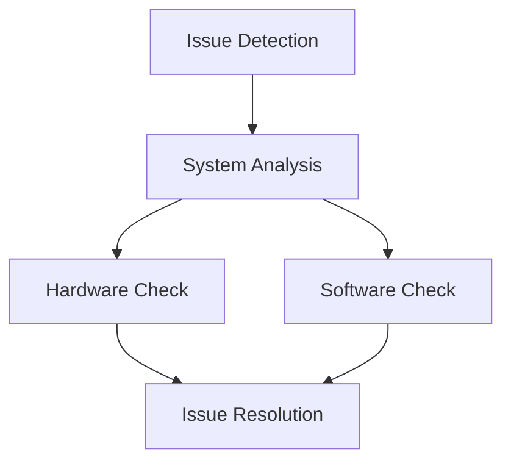

# Advanced Troubleshooting

## Difficulty Level
Advanced

## Estimated Reading Time
30 minutes

## Prerequisites
- [Basic Troubleshooting](../quick-start/troubleshooting.md)
- [Hardware Optimization](hardware-optimization.md)
- [Model Tuning](model-tuning.md)

## Topics Covered
- System diagnostics
- Performance analysis
- Memory management
- Error resolution
- Prevention strategies



## System Diagnostics
```python
def diagnose_system():
    # Check hardware status
    # Verify software configuration
    # Analyze performance metrics
```

## Common Complex Issues
1. Memory Management
   - VRAM exhaustion
   - System RAM depletion
   - Swap space issues

2. Model Performance
   - Response degradation
   - Loading failures
   - Quantization issues

## Related Topics
- [Hardware Optimization](hardware-optimization.md)
- [Token Management](token-management.md)
- [Model Tuning](model-tuning.md)
- [Tool Architecture](tool-architecture.md)

## Technical Terms
- Resource Management
- Error Handling
- Performance Optimization
- System Integration
- Memory Mapping

## Next Steps
1. [Performance Monitoring](hardware-optimization.md)
2. [System Optimization](architecture.md)
3. [Advanced Configuration](model-tuning.md)