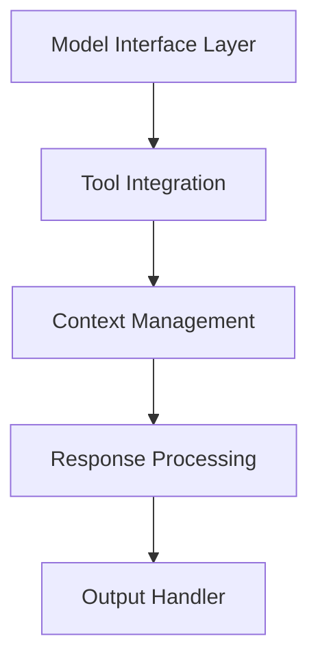

# Architecture Deep Dive

Detailed exploration of the local LLM system architecture and its components.

## Difficulty Level
Advanced

## Estimated Reading Time
30 minutes

{: .note }
Understanding the system architecture is crucial for advanced usage and optimization.

## Prerequisites
- All quick-start guides completed
- Basic understanding of LLMs
- Programming experience

## Topics Covered
- Core components
- Implementation details
- Performance considerations
- System integration
- Error handling

## System Architecture



## Core Components

{: .content-card }
### Model Interface Layer
1. Direct LLM Communication
   - Model initialization
   - Request handling
   - Response processing
   - Error management

2. Resource Management
   - Memory allocation
   - GPU utilization
   - Cache handling
   - Cleanup routines

3. Token Management
   - Context window handling
   - Token counting
   - Response streaming
   - Buffer management

{: .tip }
Implement proper cleanup routines to prevent memory leaks and resource exhaustion.

## Tool Integration Framework

### Component Integration
```python
class ToolFramework:
    def __init__(self):
        self.tools = {}
        self.context = Context()
        self.validator = Validator()
    
    def register_tool(self, tool_config):
        """Register a new tool with the framework"""
        # Validate tool interface
        self.validator.validate_tool(tool_config)
        # Register capabilities
        self.tools[tool_config.name] = tool_config
        # Configure handlers
        self._setup_handlers(tool_config)
```

## Performance Optimization

{: .content-card }
### Memory Management
1. Efficient Allocation
   - Dynamic memory management
   - Smart caching strategies
   - Resource pooling
   - Garbage collection

2. Cache Optimization
   - Response caching
   - Model weight sharing
   - Intermediate results
   - Token caching

## System Integration

### Integration Patterns
1. API Integration
   - REST endpoints
   - WebSocket support
   - Authentication
   - Rate limiting

2. Tool Communication
   - Inter-process communication
   - Message queuing
   - Event handling
   - Error propagation

## Error Handling

{: .content-card }
### Error Management Strategy
1. Error Categories
   - Model errors
   - Resource errors
   - Integration errors
   - System errors

2. Recovery Procedures
   - Automatic retry
   - Graceful degradation
   - Resource cleanup
   - State recovery

## Related Topics
- [Hardware Optimization](hardware-optimization.md) - Resource management
- [Token Management](token-management.md) - Context handling
- [Tool Architecture](tool-architecture.md) - Tool integration
- [Model Tuning](model-tuning.md) - Performance

## Technical Terms
- **Context Window**: Model's memory size
- **Token Management**: Text processing system
- **Model Quantization**: Size reduction technique
- **Memory Management**: Resource handling strategy

## Next Steps
1. [Hardware Optimization](hardware-optimization.md)
2. [Token Management](token-management.md)
3. [Tool Architecture](tool-architecture.md)