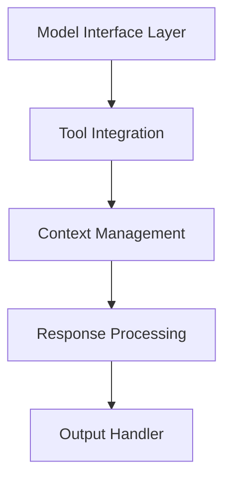

# Architecture Deep Dive

## Difficulty Level
Advanced

## Estimated Reading Time
30 minutes

## Prerequisites
- All quick-start guides
- Basic understanding of LLMs
- Programming experience

## Topics Covered
- Core components
- Implementation details
- Performance considerations
- System integration
- Error handling

## Core Components

### Model Interface Layer
- Direct LLM communication
- Model loading/initialization
- Resource management
- Token management

### Tool Integration Framework
- Standardized interfaces
- Tool execution handling
- Response processing
- Error management

## Related Topics
- [Hardware Optimization](hardware-optimization.md) - Resource management
- [Token Management](token-management.md) - Context handling
- [Tool Architecture](tool-architecture.md) - Tool integration
- [Model Tuning](model-tuning.md) - Performance

## Technical Terms
- Context Window - Model memory size
- Token Management - Text processing
- Model Quantization - Size reduction
- Memory Management - Resource handling

## Next Steps
1. [Hardware Optimization](hardware-optimization.md)
2. [Token Management](token-management.md)
3. [Tool Architecture](tool-architecture.md)