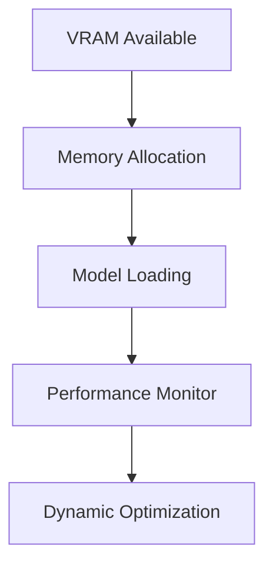

# Hardware Optimization

Advanced strategies for maximizing hardware performance with local LLMs.

## Difficulty Level
Advanced

## Estimated Reading Time
25 minutes

{: .note }
Hardware optimization is crucial for achieving maximum performance from local LLMs.

## Prerequisites
- [Hardware Requirements](../quick-start/hardware-requirements.md)
- [Architecture](architecture.md)

## Topics Covered
- Memory management
- Performance optimization
- Resource monitoring
- Hardware configuration
- System tuning

## Performance Benchmarks

{: .content-card }
### Token Generation Speed
- KoboldCpp with GPU: ~65 tokens/second
- llama.cpp with GPU: ~13.89 tokens/second
- llama.cpp CPU-only: ~3.47 tokens/second

## System Architecture



## Memory Management

{: .content-card }
### Dynamic Allocation Strategies
1. Memory Mapping
   - Efficient page allocation
   - Smart caching strategies
   - Swap optimization
   - Resource pooling

2. Cache Management
   - L1/L2 cache optimization
   - Memory access patterns
   - Prefetching strategies
   - Cache line alignment

{: .tip }
Monitor GPU memory usage in real-time using `nvidia-smi dmon` for optimal performance tuning.

## GPU Optimization

### CUDA Configuration
```bash
# Set CUDA device properties
export CUDA_VISIBLE_DEVICES=0
export CUDA_LAUNCH_BLOCKING=1

# Monitor GPU usage
nvidia-smi -l 1
```

### Performance Settings
1. Thread Management
   - Optimal thread count
   - Core affinity
   - Thread scheduling
   - Load balancing

2. Memory Settings
   - VRAM allocation
   - Unified memory
   - Page size
   - Cache settings

## CPU Optimization

{: .content-card }
### Resource Management
1. Core Allocation
   - Process priority
   - CPU affinity
   - Thread mapping
   - Load distribution

2. Memory Access
   - NUMA awareness
   - Memory alignment
   - Cache optimization
   - TLB management

## Storage Optimization

### I/O Performance
1. Disk Configuration
   - NVMe optimization
   - RAID setup
   - I/O scheduling
   - Buffer size

2. File System
   - Journal settings
   - Block size
   - Mount options
   - Cache policy

## Monitoring Tools

{: .content-card }
### Performance Analysis
```bash
# GPU monitoring
nvidia-smi --query-gpu=timestamp,name,pci.bus_id,driver_version,pstate,pcie.link.gen.max,\
temperature.gpu,utilization.gpu,utilization.memory,memory.total,memory.free,memory.used \
--format=csv -l 1

# CPU monitoring
top -b -n 1
```

## Related Topics
- [Architecture](architecture.md) - System design
- [Token Management](token-management.md) - Memory usage
- [Model Tuning](model-tuning.md) - Performance
- [Advanced Troubleshooting](advanced-troubleshooting.md)

## Technical Terms
- **VRAM**: GPU memory
- **CUDA**: NVIDIA compute platform
- **Memory Mapping**: Resource allocation
- **Cache Optimization**: Performance enhancement

## Next Steps
1. [Model Tuning](model-tuning.md)
2. [Token Management](token-management.md)
3. [Advanced Troubleshooting](advanced-troubleshooting.md)