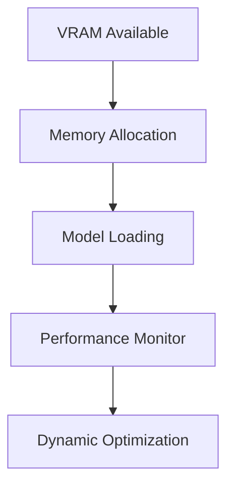

# Hardware Optimization

## Difficulty Level
Advanced

## Estimated Reading Time
25 minutes

## Prerequisites
- [Hardware Requirements](../quick-start/hardware-requirements.md)
- [Architecture](architecture.md)

## Topics Covered
- Memory management
- Performance optimization
- Resource monitoring
- Hardware configuration
- System tuning

## Performance Benchmarks
Token Generation Speed:
- KoboldCpp with GPU: ~65 tokens/second
- llama.cpp with GPU: ~13.89 tokens/second
- llama.cpp CPU-only: ~3.47 tokens/second

## Memory Management
- Dynamic allocation strategies
- Intelligent swapping
- Cache optimization
- Resource monitoring

## CPU Optimization
- Thread management
- Cache handling
- Process priority
- Core allocation

## Related Topics
- [Architecture](architecture.md) - System design
- [Token Management](token-management.md) - Memory usage
- [Model Tuning](model-tuning.md) - Performance
- [Advanced Troubleshooting](advanced-troubleshooting.md)

## Technical Terms
- VRAM - GPU memory
- CUDA - NVIDIA compute platform
- Memory Mapping - Resource allocation
- Cache Optimization - Performance enhancement

## Next Steps
1. [Model Tuning](model-tuning.md)
2. [Token Management](token-management.md)
3. [Advanced Troubleshooting](advanced-troubleshooting.md)