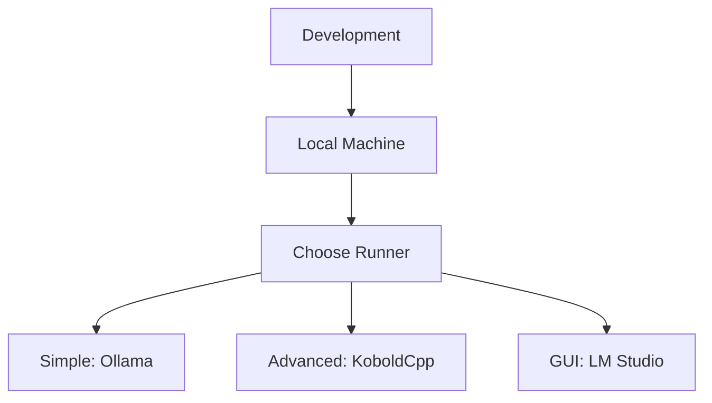

# LLM Runner Comparison

In-depth analysis and comparison of different LLM runners for local deployment.

## Difficulty Level
Advanced

## Estimated Reading Time
35 minutes

{: .note }
Choose your LLM runner based on your specific requirements for performance, ease of use, and features.

## Overview

A comprehensive comparison of popular LLM runners for local deployment and usage.

## Comparison Matrix

{: .content-card }
| Feature | Ollama | LM Studio | KoboldCpp | Text Generation WebUI |
|---------|---------|------------|-----------|----------------------|
| Installation | Single curl command | GUI installer | Manual setup | Python pip install |
| Interface | CLI + API | GUI + API | GUI + API | Web UI + API |
| Model Management | Built-in pulls | Manual downloads | Manual downloads | HF integration |
| Hardware Support | CUDA + CPU | CUDA + CPU | CUDA + CPU | CUDA + CPU + ROCm |
| API Performance | ~65 tokens/s | Varies by model | ~13.89 tokens/s | ~3.47 tokens/s |
| VRAM Usage | Efficient | Standard | Very efficient | Standard |
| Context Window | Up to 32k | Model dependent | Model dependent | Model dependent |
| Quantization | Built-in | Custom GGUF | GGUF support | Multiple formats |

## Detailed Analysis

{: .content-card }
### Ollama
**Pros:**
- One-line installation
- Built-in model management
- REST API + WSS support
- Docker integration

**Cons:**
- Limited model format support
- Fixed API implementation
- Less granular control

{: .tip }
Ollama is recommended for quick deployment and container environments.

### LM Studio
**Pros:**
- User-friendly GUI
- Multiple model sources
- Flexible quantization
- Built-in chat interface

**Cons:**
- Manual model downloads
- Windows/Mac focus
- Limited CLI options

**Best for:** Desktop development and model testing

## Integration Examples

### Ollama Setup
```bash
# Installation
curl -fsSL https://ollama.com/install.sh | sh

# Model pull
ollama pull qwen2.5-coding

# Run server
ollama serve
```

### API Integration
```python
import requests

def generate_text(prompt, model="qwen2.5-coding"):
    response = requests.post(
        'http://localhost:11434/api/generate',
        json={
            "model": model,
            "prompt": prompt,
            "parameters": {
                "temperature": 0.7,
                "top_p": 0.9
            }
        }
    )
    return response.json()
```

## Performance Comparison

{: .content-card }
### Token Generation Speed
- KoboldCpp/GPU: ~65 tokens/second
- llama.cpp/GPU: ~13.89 tokens/second
- CPU-only: ~3.47 tokens/second

### Memory Usage
| Quantization | VRAM Usage | Performance Impact |
|--------------|------------|-------------------|
| 4-bit | ~8GB | Moderate degradation |
| 8-bit | ~16GB | Minor degradation |
| Full precision | ~24GB+ | No degradation |

## Deployment Scenarios

### Development Environment


## Related Topics
- [Hardware Optimization](hardware-optimization.md)
- [Model Selection](../quick-start/model-selection.md)
- [Tool Usage](../quick-start/tool-usage.md)
- [Performance Tuning](model-tuning.md)

## Technical Terms
- **GGUF**: GPU-optimized model format
- **ROCm**: AMD's GPU computing platform
- **WSS**: WebSocket secure protocol
- **Quantization**: Model compression technique

## Next Steps
1. [Hardware Optimization](hardware-optimization.md)
2. [Model Selection](model-selection-guide.md)
3. [Performance Tuning](model-tuning.md)