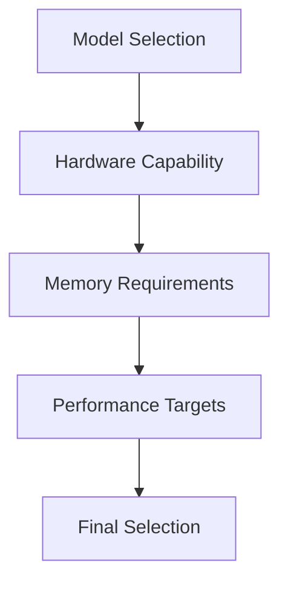

# Advanced Model Selection Guide

Comprehensive analysis for selecting appropriate local Large Language Models based on requirements and hardware capabilities.

## Difficulty Level
Advanced

## Estimated Reading Time
40 minutes

{: .note }
Model selection significantly impacts system performance, resource utilization, and output quality.

## Prerequisites
- [Basic Model Selection](../quick-start/model-selection.md)
- [Hardware Requirements](../quick-start/hardware-requirements.md)
- [Hardware Optimization](hardware-optimization.md)

## Comparative Model Evaluation

{: .content-card }
| Feature | Ollama | `Llama.cpp` | vLLM | KoboldCpp |
|---------|---------|--------------|-------|------------|
| Ease of Use | Flexible library selection | Lightweight C++ implementation | Scalable with customization | User-friendly GUI + CLI |
| Hardware Support | Optimized for Nvidia GPUs | Broad CPU/GPU support | Focus on scalability | GPU-focused; GGUF quantization |
| Latency | Low latency | Moderate latency | Higher latency in real-time | Low latency with optimizations |
| Throughput | Moderate | High with optimized setup | High in batch processing | High with GPU optimization |
| Customization | Manual library overrides | Open-source flexibility | Extensive configuration options | Advanced quantization control |

## Performance Analysis



## Model Performance Metrics

{: .content-card }
### KoboldCpp Performance
- Token Generation: Up to 65 tokens/second
- Context Length: Supports up to 8k
- Memory Usage: Efficient with layer offloading
- Response Time: Low latency

{: .tip }
Monitor performance metrics during initial testing to ensure optimal model selection.

## Hardware Compatibility Matrix

| Model Size | Minimum VRAM | Recommended VRAM | CPU Requirements |
|------------|--------------|------------------|------------------|
| 7B         | 8GB          | 12GB             | 4 cores/8 threads |
| 13B        | 16GB         | 24GB             | 8 cores/16 threads |
| 33B+       | 32GB         | 48GB             | 16 cores/32 threads |

## Model Selection Criteria

### Technical Requirements
1. Context Window
   - Minimum 32k tokens
   - Efficient memory usage
   - Dynamic allocation
   - Context management

2. Response Quality
   - Code generation accuracy
   - Tool usage capabilities
   - Error handling
   - Output consistency

## Model Evaluation Process

### Performance Testing
```python
def evaluate_model(model_path, test_cases):
    results = {
        'latency': [],
        'throughput': [],
        'memory_usage': [],
        'accuracy': []
    }
    
    for test in test_cases:
        # Run performance tests
        results['latency'].append(measure_latency(model_path, test))
        results['throughput'].append(measure_throughput(model_path, test))
        results['memory_usage'].append(monitor_memory(model_path, test))
        results['accuracy'].append(evaluate_accuracy(model_path, test))
    
    return analyze_results(results)
```

## Optimization Strategies

{: .content-card }
### Memory Optimization
1. Quantization Techniques
   - INT4 quantization
   - INT8 quantization
   - Mixed precision
   - Dynamic quantization

2. Layer Management
   - Gradient checkpointing
   - Layer offloading
   - Memory swapping
   - Cache optimization

## Model Compatibility Testing

### Test Suite
```python
class ModelCompatibilityTest:
    def __init__(self, model_path):
        self.model_path = model_path
        self.tests = []

    def run_compatibility_tests(self):
        self.test_memory_requirements()
        self.test_performance_metrics()
        self.test_tool_compatibility()
        self.test_error_handling()
        
        return self.generate_report()
```

## Related Topics
- [Hardware Optimization](hardware-optimization.md)
- [Model Tuning](model-tuning.md)
- [Token Management](token-management.md)
- [Performance Analysis](llm-runner-comparison.md)

## Technical Terms
- **GGUF**: Optimized model format
- **Layer Offloading**: Memory management technique
- **Context Window**: Token processing capacity
- **Quantization**: Model compression method

## Next Steps
1. [Model Tuning](model-tuning.md)
2. [Hardware Optimization](hardware-optimization.md)
3. [Performance Testing](llm-runner-comparison.md)