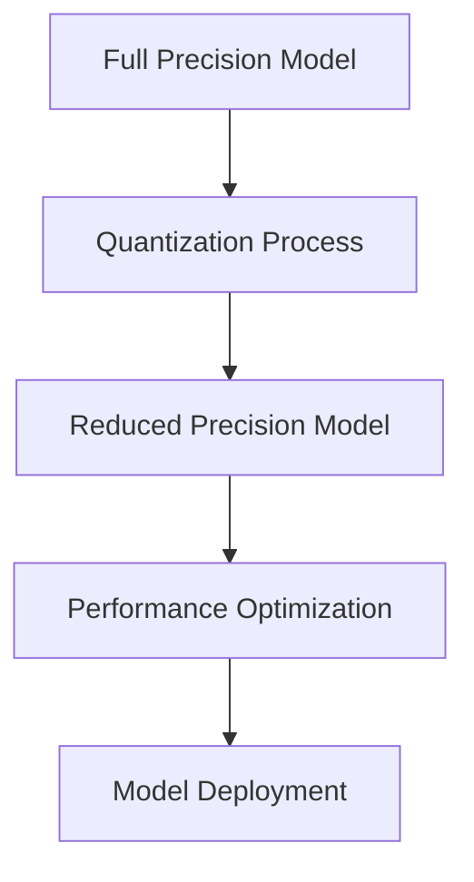

# Model Tuning

## Difficulty Level
Advanced

## Estimated Reading Time
35 minutes

## Prerequisites
- [Model Selection](../quick-start/model-selection.md)
- [Hardware Optimization](hardware-optimization.md)

## Topics Covered
- Parameter optimization
- Memory management
- Performance tuning
- Model adaptation
- Quantization techniques

## Optimal Settings Matrix
| Model Size | Temperature | Top-p | Context | Quantization |
|------------|------------|-------|----------|--------------|
| 7B | 0.7-0.8 | 0.9 | 2048-4096 | 4-bit |
| 13B-33B | 0.6-0.7 | 0.92 | 4096-8192 | 8-bit |
| 70B+ | 0.5-0.6 | 0.95 | 8192-32768 | None |

## Performance Optimization
- Dynamic loading
- Attention optimization
- Memory-efficient transformers
- Gradient checkpointing

## Related Topics
- [Hardware Optimization](hardware-optimization.md)
- [Token Management](token-management.md)
- [Tool Architecture](tool-architecture.md)
- [Advanced Troubleshooting](advanced-troubleshooting.md)

## Technical Terms
- Temperature - Output randomness
- Top-p - Nucleus sampling
- Context Window - Memory size
- Quantization - Precision reduction

## Next Steps
1. [Token Management](token-management.md)
2. [Advanced Troubleshooting](advanced-troubleshooting.md)
3. [Tool Architecture](tool-architecture.md)