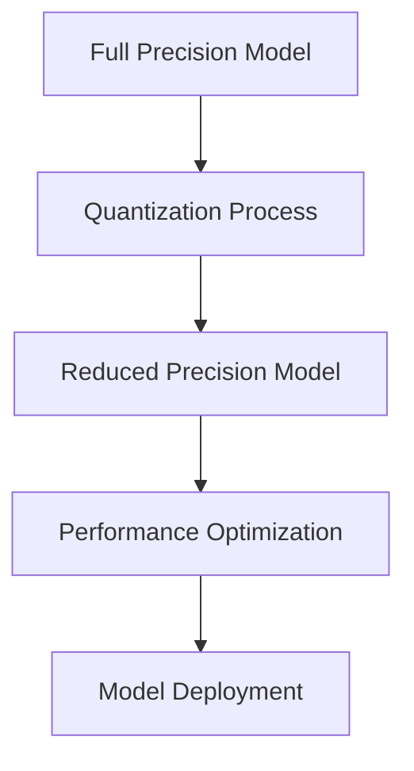

# Model Tuning

Advanced strategies for optimizing model performance and resource utilization.

## Difficulty Level
Advanced

## Estimated Reading Time
35 minutes

{: .note }
Model tuning can significantly impact performance, resource usage, and output quality.

## Prerequisites
- [Model Selection](../quick-start/model-selection.md)
- [Hardware Optimization](hardware-optimization.md)

## Topics Covered
- Parameter optimization
- Memory management
- Performance tuning
- Model adaptation
- Quantization techniques

## Tuning Process



## Parameter Optimization

{: .content-card }
### Optimal Settings Matrix
| Model Size | Temperature | Top-p | Context | Quantization |
|------------|------------|-------|----------|--------------|
| 7B | 0.7-0.8 | 0.9 | 2048-4096 | 4-bit |
| 13B-33B | 0.6-0.7 | 0.92 | 4096-8192 | 8-bit |
| 70B+ | 0.5-0.6 | 0.95 | 8192-32768 | None |

{: .tip }
Start with conservative settings and adjust based on observed performance.

## Memory Management

### Dynamic Loading
```python
class ModelManager:
    def __init__(self, model_path):
        self.model_path = model_path
        self.loaded_layers = {}
        
    def load_layer(self, layer_id):
        if layer_id not in self.loaded_layers:
            self.loaded_layers[layer_id] = load_from_disk(
                f"{self.model_path}/layer_{layer_id}"
            )
        return self.loaded_layers[layer_id]
        
    def unload_layer(self, layer_id):
        if layer_id in self.loaded_layers:
            del self.loaded_layers[layer_id]
```

## Performance Optimization

{: .content-card }
### Optimization Techniques
1. Attention Optimization
   - Sparse attention
   - Flash attention
   - Memory-efficient attention
   - Sliding window attention

2. Memory Efficiency
   - Gradient checkpointing
   - Layer offloading
   - Memory swapping
   - Cache optimization

## Quantization Strategies

### Implementation Example
```python
def quantize_model(model, bits=4):
    """
    Quantize model weights to reduced precision
    """
    config = QuantizationConfig(
        bits=bits,
        scheme='symmetric',
        granularity='per-tensor'
    )
    
    quantized_model = quantize(model, config)
    validate_accuracy(quantized_model)
    
    return quantized_model
```

## Model Adaptation

{: .content-card }
### Fine-tuning Process
1. Data Preparation
   - Dataset selection
   - Preprocessing
   - Validation split
   - Quality checks

2. Training Configuration
   - Learning rate
   - Batch size
   - Training steps
   - Evaluation metrics

## Monitoring and Evaluation

### Performance Metrics
```python
class PerformanceMonitor:
    def __init__(self):
        self.metrics = {
            'latency': [],
            'throughput': [],
            'memory_usage': [],
            'accuracy': []
        }
    
    def log_metrics(self, **kwargs):
        for key, value in kwargs.items():
            if key in self.metrics:
                self.metrics[key].append(value)
    
    def generate_report(self):
        return {
            key: statistics.mean(values)
            for key, values in self.metrics.items()
        }
```

## Related Topics
- [Hardware Optimization](hardware-optimization.md)
- [Token Management](token-management.md)
- [Tool Architecture](tool-architecture.md)
- [Advanced Troubleshooting](advanced-troubleshooting.md)

## Technical Terms
- **Temperature**: Output randomness control
- **Top-p**: Nucleus sampling parameter
- **Context Window**: Token processing capacity
- **Quantization**: Precision reduction technique

## Next Steps
1. [Token Management](token-management.md)
2. [Advanced Troubleshooting](advanced-troubleshooting.md)
3. [Tool Architecture](tool-architecture.md)