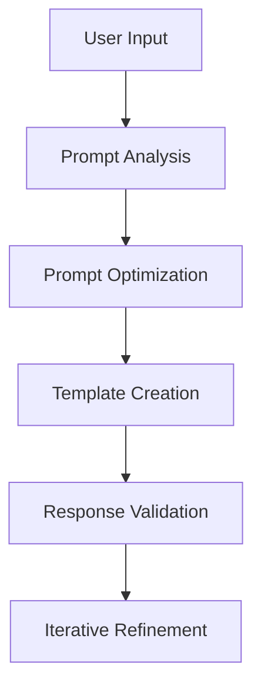

# Prompt Engineering for Local LLMs

Advanced strategies for optimizing prompt interactions with local Large Language Models.

## Difficulty Level
Advanced

## Estimated Reading Time
45 minutes

{: .note }
Local LLMs require specialized prompt engineering techniques compared to cloud-based models.

## Prerequisites
- [Model Selection](../quick-start/model-selection.md)
- [Model Tuning](model-tuning.md)
- [Tool Usage](../quick-start/tool-usage.md)

## Key Challenges

{: .content-card }
### Resource Constraints
1. Computational Limitations
   - Limited VRAM
   - Smaller context windows
   - Lower processing capacity
   - Memory constraints

2. Performance Impact
   - Model-specific behaviors
   - Reduced capabilities
   - Prompt sensitivity
   - Resource efficiency

## Prompt Optimization Flow



## Model-Specific Strategies

### Quantization-Aware Prompting
```python
def adapt_prompt_to_quantization(model, prompt):
    """
    Adapt prompt complexity based on model's quantization level
    """
    if model.quantization_level <= 4:
        return simplify_prompt(prompt)
    elif model.quantization_level <= 8:
        return moderate_complexity_prompt(prompt)
    else:
        return original_prompt
```

{: .tip }
Adjust prompt complexity based on model quantization level to maintain optimal performance.

## Token Usage Optimization

{: .content-card }
### Compression Techniques
1. Context Optimization
   ```python
   def compress_prompt(prompt, max_tokens=1024):
       """
       Compress prompt while maintaining core information
       """
       compressed = remove_redundant_context(prompt)
       return truncate_to_token_limit(compressed, max_tokens)
   ```

2. Context Management
   - Priority-based retention
   - Rolling windows
   - Dynamic pruning
   - Context summarization

## System Prompts

### Role Definition
```yaml
system_prompt: |
  You are an expert Python developer assistant.
  Your responses should:
  - Follow PEP 8 guidelines
  - Provide clear explanations
  - Offer optimization tips
  - Handle edge cases
```

## Response Quality

{: .content-card }
### Output Validation
```python
def validate_response(response, requirements):
    """
    Validate model response against requirements
    """
    checks = [
        check_format(response),
        verify_completeness(response),
        validate_content(response, requirements)
    ]
    return all(checks)
```

## Advanced Techniques

### Chain-of-Thought Implementation
```python
def implement_cot(prompt):
    """
    Implement chain-of-thought reasoning
    """
    return f"""
    Let's solve this step by step:
    1) First, understand the problem:
       {prompt}
    2) Break it down into components:
       - [Component breakdown]
    3) Solve each component:
       - [Component solutions]
    4) Combine the solutions:
       - [Final solution]
    """
```

## Performance Monitoring

{: .content-card }
### Metrics Tracking
1. Response Analysis
   - Generation speed
   - Response quality
   - Token efficiency
   - Error rates

2. Pattern Recognition
   - Common failures
   - Success patterns
   - Resource usage
   - Performance bottlenecks

## Troubleshooting

### Common Issues
1. Response Quality
   - Inconsistent outputs
   - Hallucinations
   - Off-topic responses
   - Repetitive content

2. Performance Issues
   - Slow generation
   - High resource usage
   - Context overflow
   - Memory exhaustion

## Related Topics
- [Token Management](token-management.md)
- [Model Tuning](model-tuning.md)
- [Hardware Optimization](hardware-optimization.md)
- [Tool Architecture](tool-architecture.md)

## Technical Terms
- **Context Window**: Token processing capacity
- **Chain-of-Thought**: Reasoning methodology
- **System Prompt**: Behavior definition
- **Token Efficiency**: Resource optimization

## Next Steps
1. [Token Management](token-management.md)
2. [Model Tuning](model-tuning.md)
3. [Tool Architecture](tool-architecture.md)