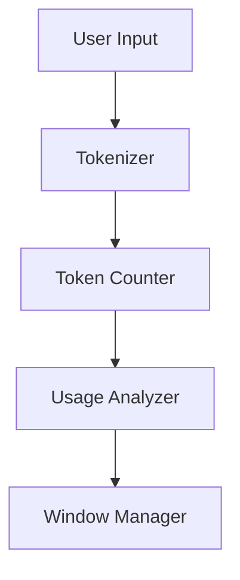

# Token Management

Advanced strategies for efficient token and context window management in local LLMs.

## Difficulty Level
Advanced

## Estimated Reading Time
25 minutes

{: .note }
Effective token management is crucial for optimal model performance and resource utilization.

## Prerequisites
- [Model Tuning](model-tuning.md)
- [Hardware Optimization](hardware-optimization.md)

## Topics Covered
- Context window management
- Token counting strategies
- Memory optimization
- Dynamic window handling
- Response optimization

## Token Management Flow



## Context Window Management

{: .content-card }
### Dynamic Window Implementation
```python
class ContextManager:
    def __init__(self, max_tokens):
        self.max_tokens = max_tokens
        self.current_tokens = []
        
    def add_tokens(self, new_tokens):
        """Add new tokens while maintaining window size"""
        if len(self.current_tokens) + len(new_tokens) > self.max_tokens:
            self._prune_context()
        self.current_tokens.extend(new_tokens)
        
    def _prune_context(self):
        """Remove least important tokens"""
        priority_score = self._calculate_priority()
        self.current_tokens = [
            token for token, score in 
            sorted(zip(self.current_tokens, priority_score), 
                  key=lambda x: x[1], 
                  reverse=True)
        ][:self.max_tokens]
```

{: .tip }
Implement efficient pruning strategies to maintain critical context while managing token limits.

## Token Optimization

### Memory-Efficient Processing
```python
def optimize_token_processing(tokens, batch_size=32):
    """Process tokens in memory-efficient batches"""
    for i in range(0, len(tokens), batch_size):
        batch = tokens[i:i + batch_size]
        process_batch(batch)
        clear_memory()
```

## Context Pruning Strategies

{: .content-card }
### Priority-Based Retention
1. Token Scoring
   - Relevance scoring
   - Recency weighting
   - Importance factors
   - Dependency analysis

2. Pruning Rules
   - Keep critical context
   - Maintain coherence
   - Preserve dependencies
   - Remove redundancy

## Performance Optimization

### Token Processing
```python
def process_tokens(tokens, window_size):
    """Efficient token processing with sliding window"""
    processed = []
    window = []
    
    for token in tokens:
        window.append(token)
        if len(window) > window_size:
            window.pop(0)
        processed.append(process_window(window))
        
    return processed
```

## Memory Management

{: .content-card }
### Resource Allocation
1. Memory Mapping
   - Token storage
   - Context caching
   - Window management
   - Resource pooling

2. Cache Optimization
   - Frequently used tokens
   - Response patterns
   - Context templates
   - System prompts

## Monitoring and Analysis

### Usage Metrics
```python
class TokenAnalytics:
    def __init__(self):
        self.metrics = {
            'token_count': 0,
            'window_usage': [],
            'pruning_events': 0,
            'cache_hits': 0
        }
    
    def log_metrics(self, **kwargs):
        for key, value in kwargs.items():
            if key in self.metrics:
                self.metrics[key] += value
```

## Related Topics
- [Model Tuning](model-tuning.md)
- [Hardware Optimization](hardware-optimization.md)
- [Tool Architecture](tool-architecture.md)
- [Advanced Troubleshooting](advanced-troubleshooting.md)

## Technical Terms
- **Token**: Text processing unit
- **Context Window**: Memory limit
- **Quantization**: Size reduction
- **Memory Management**: Resource control

## Next Steps
1. [Tool Architecture](tool-architecture.md)
2. [Advanced Troubleshooting](advanced-troubleshooting.md)
3. [Performance Optimization](hardware-optimization.md)