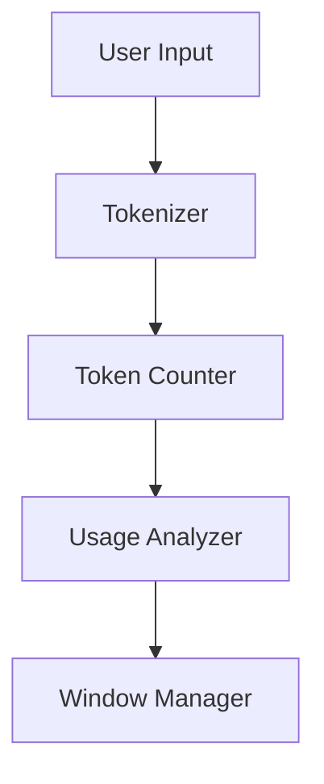

# Token Management

## Difficulty Level
Advanced

## Estimated Reading Time
25 minutes

## Prerequisites
- [Model Tuning](model-tuning.md)
- [Hardware Optimization](hardware-optimization.md)

## Topics Covered
- Context window management
- Token counting strategies
- Memory optimization
- Dynamic window handling
- Response optimization



## Dynamic Window Management
- Sliding window implementation
- Priority-based token retention
- Automatic context pruning
- Memory optimization

## Context Pruning
```python
def prune_context(context, max_tokens):
    # Priority-based pruning
    # Retain critical information
    # Remove redundant tokens
```

## Related Topics
- [Model Tuning](model-tuning.md)
- [Hardware Optimization](hardware-optimization.md)
- [Tool Architecture](tool-architecture.md)
- [Advanced Troubleshooting](advanced-troubleshooting.md)

## Technical Terms
- Token - Text unit
- Context Window - Memory limit
- Quantization - Size reduction
- Memory Management - Resource control

## Next Steps
1. [Tool Architecture](tool-architecture.md)
2. [Advanced Troubleshooting](advanced-troubleshooting.md)
3. [Performance Optimization](hardware-optimization.md)