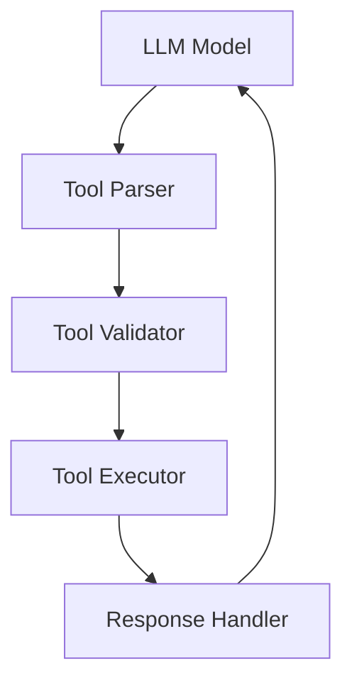

# Tool Architecture

In-depth exploration of the tool framework design and implementation for local LLMs.

## Difficulty Level
Advanced

## Estimated Reading Time
30 minutes

{: .note }
Understanding tool architecture is essential for extending and optimizing LLM capabilities.

## Prerequisites
- [Tool Usage](../quick-start/tool-usage.md)
- [Architecture](architecture.md)
- Programming experience

## Topics Covered
- Tool framework design
- Integration patterns
- Resource management
- Implementation details
- Performance optimization

## System Architecture



## Core Components

{: .content-card }
### Tool Framework Implementation
```python
class ToolFramework:
    def __init__(self):
        self.tools = {}
        self.validators = {}
        self.handlers = {}
        
    def register_tool(self, tool_config):
        """Register a new tool with validation"""
        if self._validate_tool_config(tool_config):
            self.tools[tool_config.name] = tool_config
            self._setup_handlers(tool_config)
        else:
            raise ValidationError("Invalid tool configuration")
            
    def execute_tool(self, tool_name, params):
        """Execute tool with error handling"""
        try:
            tool = self.tools[tool_name]
            validated_params = self.validators[tool_name](params)
            result = tool.execute(validated_params)
            return self.handlers[tool_name](result)
        except Exception as e:
            self._handle_error(e)
```

{: .tip }
Implement comprehensive validation to ensure tool reliability and security.

## Resource Management

### Memory Management
```python
class ResourceManager:
    def __init__(self):
        self.active_tools = {}
        self.resource_pools = {}
        
    def allocate_resources(self, tool_name):
        """Allocate resources for tool execution"""
        if tool_name in self.active_tools:
            return self.active_tools[tool_name]
        
        resources = self._create_resource_pool(tool_name)
        self.active_tools[tool_name] = resources
        return resources
        
    def cleanup(self):
        """Release unused resources"""
        for tool_name in list(self.active_tools.keys()):
            if not self._is_tool_active(tool_name):
                self._release_resources(tool_name)
```

## Tool Integration

{: .content-card }
### Integration Patterns
1. Event-Based Integration
   - Event dispatching
   - Async handling
   - Queue management
   - State tracking

2. Resource Sharing
   - Memory pooling
   - Cache sharing
   - Connection pooling
   - Context sharing

## Performance Optimization

### Caching Strategy
```python
class ToolCache:
    def __init__(self):
        self.cache = {}
        self.stats = {'hits': 0, 'misses': 0}
        
    def get_result(self, tool_name, params):
        """Get cached tool result"""
        cache_key = self._generate_key(tool_name, params)
        if cache_key in self.cache:
            self.stats['hits'] += 1
            return self.cache[cache_key]
        self.stats['misses'] += 1
        return None
```

## Error Handling

{: .content-card }
### Error Management
1. Validation Errors
   - Parameter validation
   - Type checking
   - Range validation
   - Format verification

2. Runtime Errors
   - Resource exhaustion
   - Timeout handling
   - Network errors
   - System errors

## Monitoring and Logging

### Performance Metrics
```python
class ToolMetrics:
    def __init__(self):
        self.metrics = {
            'execution_time': [],
            'memory_usage': [],
            'error_count': 0,
            'success_rate': 0
        }
    
    def log_execution(self, tool_name, duration, memory_used):
        """Log tool execution metrics"""
        self.metrics['execution_time'].append(duration)
        self.metrics['memory_usage'].append(memory_used)
        self._update_success_rate()
```

## Related Topics
- [Architecture](architecture.md)
- [Token Management](token-management.md)
- [Model Tuning](model-tuning.md)
- [Hardware Optimization](hardware-optimization.md)

## Technical Terms
- **Tool Integration**: Component connection
- **Command Parser**: Input processing
- **Response Handler**: Output management
- **Resource Management**: Asset control

## Next Steps
1. [Advanced Troubleshooting](advanced-troubleshooting.md)
2. [Performance Optimization](hardware-optimization.md)
3. [System Integration](architecture.md)