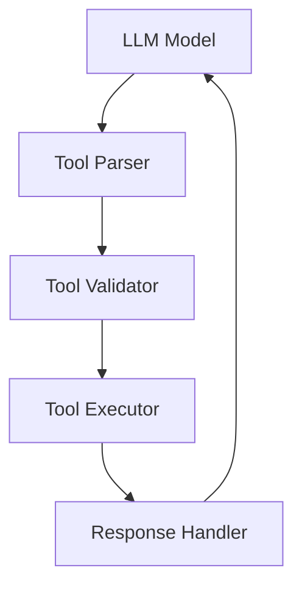

# Tool Architecture

## Difficulty Level
Advanced

## Estimated Reading Time
30 minutes

## Prerequisites
- [Tool Usage](../quick-start/tool-usage.md)
- [Architecture](architecture.md)

## Topics Covered
- Tool framework design
- Integration patterns
- Resource management
- Implementation details
- Performance optimization



## Implementation Details
```python
def register_tool(tool_config):
    # Validate tool interface
    # Register capabilities
    # Configure handlers
```

## Resource Management
- Tool loading strategies
- Resource allocation
- Cache management
- Performance monitoring

## Related Topics
- [Architecture](architecture.md)
- [Token Management](token-management.md)
- [Model Tuning](model-tuning.md)
- [Hardware Optimization](hardware-optimization.md)

## Technical Terms
- Tool Integration
- Command Parser
- Response Handler
- Resource Management
- Cache Optimization

## Next Steps
1. [Advanced Troubleshooting](advanced-troubleshooting.md)
2. [Performance Optimization](hardware-optimization.md)
3. [System Integration](architecture.md)