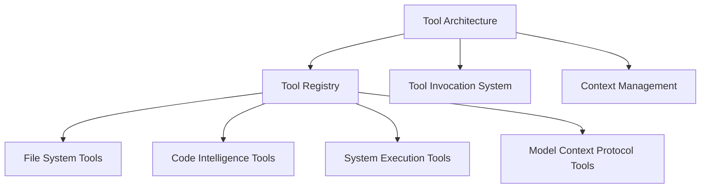

# AI Coding Agents: Tool Architecture and RooCode Implementation

## Difficulty Level
Advanced

## Estimated Reading Time
60 minutes

## Prerequisites
- [Quick Start Guide](../quick-start/local-llm-quick-path.md)
- Basic understanding of AI coding agents
- Familiarity with software development concepts

## Topics Covered
- Tool architecture design
- RooCode tool implementation
- Tool categories and functionality
- Integration strategies
- BigCodeBench use cases



## Tool Architecture in AI Coding Agents

AI coding agents employ a tool-based architecture to bridge the gap between natural language understanding and concrete development tasks. This architecture consists of several key components:

# AI Coding Agents: Tool Architecture and RooCode Implementation

## Tool Architecture in AI Coding Agents

AI coding agents employ a tool-based architecture to bridge the gap between natural language understanding and concrete development tasks. This architecture consists of several key components:

### Core Components

1. **Tool Registry**
   - Maintains a collection of available tools
   - Defines tool schemas and interfaces
   - Handles tool registration and discovery

2. **Tool Invocation System**
   - Parses user intent into tool calls
   - Manages tool execution flow
   - Handles results and error states
   - Coordinates sequential and parallel tool execution

3. **Context Management**
   - Maintains conversation and execution state
   - Tracks file system and workspace context
   - Manages tool execution history

4. **Tool Categories**
   - File System Operations (read, write, search)
   - Code Analysis and Manipulation
   - Environment Interaction (terminal, git)
   - Project Management
   - Documentation

## RooCode Tool Implementation

Based on the file organization, RooCode implements a sophisticated tool system with clear separation of concerns. Here's a detailed analysis of RooCode's tool architecture:

### 1. File System Operations
RooCode provides comprehensive file handling through multiple specialized tools:
- `read-file.ts`: File content reading operations
- `write-to-file.ts`: File writing and modification
- `list-files.ts`: Directory traversal and file listing
- `search-files.ts`: File content search functionality
- `search-and-replace.ts`: Content modification across files

### 2. Code Intelligence
Tools focused on code understanding and manipulation:
- `list-code-definition-names.ts`: Code symbol and definition extraction
- `insert-content.ts`: Intelligent code insertion capabilities
- `attempt-completion.ts`: Code completion functionality

### 3. Execution and Control
System interaction and workflow control:
- `execute-command.ts`: Command execution interface
- `browser-action.ts`: Web browser interaction
- `switch-mode.ts`: Tool mode switching capability
- `new-task.ts`: Task creation and management

### 4. Model Context Protocol (MCP)
Advanced context management through MCP:
- `access-mcp-resource.ts`: Resource access through MCP
- `use-mcp-tool.ts`: MCP tool utilization

### 5. Meta Tools
Tools for managing the tool system itself:
- `ask-followup-question.ts`: Interactive clarification
- `types.ts`: Type definitions for the tool system
- `index.ts`: Tool system entry point

### Architecture Highlights

1. **Modularity**
   - Each tool is implemented as a separate module
   - Clear separation of concerns between different tool types
   - Consistent interface through types.ts

2. **Extensibility**
   - New tools can be added by implementing the core interfaces
   - MCP support allows for dynamic tool creation
   - Modular design enables easy updates and modifications

3. **Intelligence Layer**
   - Tools integrate with LLM capabilities
   - Support for interactive refinement through followup questions
   - Context-aware execution through MCP

4. **Workflow Integration**
   - Comprehensive support for development workflows
   - Browser integration for web development
   - Task management capabilities

# RooCode Tool Guide: Comprehensive Tool Examples and BigCodeBench Integration

## Core Communication Tools

### 1. ask_followup_question

**RooCode Source Code Reference:** [https://github.com/RooVetGit/Roo-Code/tree/main/src/core/prompts/tools/ask-followup-question.ts](https://github.com/RooVetGit/Roo-Code/tree/main/src/core/prompts/tools/ask-followup-question.ts)

#### Existing RooCode Example
```xml
<ask_followup_question>
<question>What is the path to the frontend-config.json file?</question>
</ask_followup_question>
```

*Explanation:* This example prompts the user to provide the path to the `frontend-config.json` file.

#### BigCodeBench-Derived Example
**BigCodeBench Task:** Understanding Complex Algorithm Implementation

```xml
<ask_followup_question>
<question>Can you explain the time complexity of the implemented sorting algorithm?</question>
</ask_followup_question>
```

*Explanation:* In a BigCodeBench competitive programming context, this tool helps clarify complex algorithmic implementations by seeking additional information from the user.

### 2. attempt_completion

**RooCode Source Code Reference:** [https://github.com/RooVetGit/Roo-Code/tree/main/src/core/prompts/tools/attempt-completion.ts](https://github.com/RooVetGit/Roo-Code/tree/main/src/core/prompts/tools/attempt-completion.ts)

#### Existing RooCode Example
```xml
<attempt_completion>
<r>
I've updated the CSS styling to match the new design requirements:
- Updated color scheme
- Improved responsive layout
- Fixed padding issues
</r>
<command>open index.html</command>
</attempt_completion>
```

*Explanation:* This example provides a progress report and suggests opening `index.html`.

#### BigCodeBench-Derived Example
**BigCodeBench Task:** Data Science Function Completion

```xml
<attempt_completion>
<r>
Complete the function below to remove missing values from the dataframe:
```python
def clean_data(df):
    # Your code here
    pass
```
</r>
<command>/complete</command>
</attempt_completion>
```

*Explanation:* In a BigCodeBench data science task, this tool helps complete a data cleaning function, demonstrating code completion in a practical context.

## File System Tools

### 3. read_file

**RooCode Source Code Reference:** [https://github.com/RooVetGit/Roo-Code/tree/main/src/core/prompts/tools/read-file.ts](https://github.com/RooVetGit/Roo-Code/tree/main/src/core/prompts/tools/read-file.ts)

#### Existing RooCode Example
```xml
<read_file>
<path>frontend-config.json</path>
</read_file>
```

*Explanation:* This example reads the content of the `frontend-config.json` file.

#### BigCodeBench-Derived Example
**BigCodeBench Task:** Security Vulnerability Analysis

```xml
<read_file>
<path>my_script.py</path>
</read_file>
```

*Explanation:* In a BigCodeBench security analysis task, this tool reads the content of a Python script to identify potential vulnerabilities.

### 4. write_to_file

**RooCode Source Code Reference:** [https://github.com/RooVetGit/Roo-Code/tree/main/src/core/prompts/tools/write-to-file.ts](https://github.com/RooVetGit/Roo-Code/tree/main/src/core/prompts/tools/write-to-file.ts)

#### Existing RooCode Example
```xml
<write_to_file>
<path>frontend-config.json</path>
<content>
{
  "apiEndpoint": "https://api.example.com",
  "theme": {
    "primaryColor": "#007bff",
    "secondaryColor": "#6c757d",
    "fontFamily": "Arial, sans-serif"
  },
  "features": {
    "darkMode": true,
    "notifications": true,
    "analytics": false
  },
  "version": "1.0.0"
}
</content>
<line_count>14</line_count>
</write_to_file>
```

*Explanation:* This example writes a new configuration to the `frontend-config.json` file.

#### BigCodeBench-Derived Example
**BigCodeBench Task:** Web Development Configuration Update

```xml
<write_to_file>
<path>config.js</path>
<content>
const API_ENDPOINT = "https://new-api.example.com";
</content>
<line_count>1</line_count>
</write_to_file>
```

*Explanation:* In a BigCodeBench web development task, this tool updates the API endpoint in a configuration file.

### 5. list_files

**RooCode Source Code Reference:** [https://github.com/RooVetGit/Roo-Code/tree/main/src/core/prompts/tools/list-files.ts](https://github.com/RooVetGit/Roo-Code/tree/main/src/core/prompts/tools/list-files.ts)

#### Existing RooCode Example
```xml
<list_files>
<path>.</path>
<recursive>false</recursive>
</list_files>
```

*Explanation:* This example lists the files in the current directory, without recursing into subdirectories.

#### BigCodeBench-Derived Example
**BigCodeBench Task:** Static Analysis Project Scanning

```xml
<list_files>
<path>.</path>
<recursive>true</recursive>
</list_files>
```

*Explanation:* In a BigCodeBench static analysis task, this tool lists all files recursively to identify potential code patterns or vulnerabilities.

### 6. search_files

**RooCode Source Code Reference:** [https://github.com/RooVetGit/Roo-Code/tree/main/src/core/prompts/tools/search-files.ts](https://github.com/RooVetGit/Roo-Code/tree/main/src/core/prompts/tools/search-files.ts)

#### Existing RooCode Example
```xml
<search_files>
<path>.</path>
<regex>.*</regex>
<file_pattern>*.ts</file_pattern>
</search_files>
```

*Explanation:* This example searches for all TypeScript files in the current directory.

#### BigCodeBench-Derived Example
**BigCodeBench Task:** Sensitive Information Detection

```xml
<search_files>
<path>.</path>
<regex>API_KEY</regex>
<file_pattern>*</file_pattern>
</search_files>
```

*Explanation:* In a BigCodeBench security analysis task, this tool searches for potential sensitive information across all files.

### 7. list_code_definition_names

**RooCode Source Code Reference:** [https://github.com/RooVetGit/Roo-Code/tree/main/src/core/prompts/tools/list-code-definition-names.ts](https://github.com/RooVetGit/Roo-Code/tree/main/src/core/prompts/tools/list-code-definition-names.ts)

#### Existing RooCode Example
```xml
<list_code_definition_names>
<path>.</path>
</list_code_definition_names>
```

*Explanation:* This example lists all code definition names in the current directory.

#### BigCodeBench-Derived Example
**BigCodeBench Task:** Library Function Analysis

```xml
<list_code_definition_names>
<path>utils.py</path>
</list_code_definition_names>
```

*Explanation:* In a BigCodeBench library analysis task, this tool helps understand the structure and available functions in a utility module.

### 8. insert_content

**RooCode Source Code Reference:** [https://github.com/RooVetGit/Roo-Code/tree/main/src/core/prompts/tools/insert-content.ts](https://github.com/RooVetGit/Roo-Code/tree/main/src/core/prompts/tools/insert-content.ts)

#### Existing RooCode Example
```xml
<insert_content>
<path>src/app.ts</path>
<operations>[
  {
    "start_line": 1,
    "content": "import { sum } from './utils';"
  },
  {
    "start_line": 10,
    "content": "function calculateTotal(items: number[]): number {\n    return items.reduce((sum, item) => sum + item, 0);\n}"
  }
]</operations>
</insert_content>
```

*Explanation:* This example imports a new dependency and inserts a new function into `src/app.ts`.

#### BigCodeBench-Derived Example
**BigCodeBench Task:** Algorithm Implementation

```xml
<insert_content>
<path>src/math_utils.py</path>
<operations>[
  {
    "start_line": 5,
    "content": "def factorial(n):\n    if n == 0:\n        return 1\n    else:\n        return n * factorial(n-1)"
  }
]</operations>
</insert_content>
```

*Explanation:* In a BigCodeBench competitive programming task, this tool adds a factorial function implementation to a math utilities file.

### 9. search_and_replace

**RooCode Source Code Reference:** [https://github.com/RooVetGit/Roo-Code/tree/main/src/core/prompts/tools/search-and-replace.ts](https://github.com/RooVetGit/Roo-Code/tree/main/src/core/prompts/tools/search-and-replace.ts)

#### Existing RooCode Example
```xml
<search_and_replace>
<path>example.ts</path>
<operations>[
  {
    "search": "foo",
    "replace": "bar",
    "start_line": 1,
    "end_line": 10
  },
  {
    "search": "old\\w+",
    "replace": "new$&",
    "use_regex": true,
    "ignore_case": true
  }
]</operations>
</search_and_replace>
```

*Explanation:* This example replaces "foo" with "bar" in lines 1-10 and uses a regex to replace "old" words.

#### BigCodeBench-Derived Example
**BigCodeBench Task:** Security Vulnerability Remediation

```xml
<search_and_replace>
<path>src/user_input.js</path>
<operations>[
  {
    "search": "<%= user_input %>",
    "replace": "<%= sanitize(user_input) %>"
  }
]</operations>
</search_and_replace>
```

*Explanation:* In a BigCodeBench security task, this tool sanitizes user input to prevent Cross-Site Scripting (XSS) vulnerabilities.

## System Tools

### 10. execute_command

**RooCode Source Code Reference:** [https://github.com/RooVetGit/Roo-Code/tree/main/src/core/prompts/tools/execute-command.ts](https://github.com/RooVetGit/Roo-Code/tree/main/src/core/prompts/tools/execute-command.ts)

#### Existing RooCode Example
```xml
<execute_command>
<command>npm run dev</command>
</execute_command>
```

*Explanation:* This example runs the "npm run dev" command.

#### BigCodeBench-Derived Example
**BigCodeBench Task:** Automated Testing

```xml
<execute_command>
<command>pytest tests/test_utils.py</command>
</execute_command>
```

*Explanation:* In a BigCodeBench testing scenario, this tool runs specific test suites to validate code implementations.

### 11. browser_action

**RooCode Source Code Reference:** [https://github.com/RooVetGit/Roo-Code/tree/main/src/core/prompts/tools/browser-action.ts](https://github.com/RooVetGit/Roo-Code/tree/main/src/core/prompts/tools/browser-action.ts)

#### Existing RooCode Example
```xml
<browser_action>
<action>launch</action>
<url>https://example.com</url>
</browser_action>
```

*Explanation:* This example launches a browser and navigates to a specific URL.

#### BigCodeBench-Derived Example
**BigCodeBench Task:** Web Application Vulnerability Testing

```xml
<browser_action>
<action>launch</action>
<url>http://localhost:8000</url>
</browser_action>
```

*Explanation:* In a BigCodeBench web security task, this tool launches a local web application for vulnerability assessment.

## Mode Management Tools

### 12. switch_mode

**RooCode Source Code Reference:** [https://github.com/RooVetGit/Roo-Code/tree/main/src/core/prompts/tools/switch-mode.ts](https://github.com/RooVetGit/Roo-Code/tree/main/src/core/prompts/tools/switch-mode.ts)

#### Existing RooCode Example
```xml
<switch_mode>
<mode_slug>code</mode_slug>
<reason>Need to make code changes</reason>
</switch_mode>
```

*Explanation:* This example switches to the "code" mode for making code changes.

#### BigCodeBench-Derived Example
**BigCodeBench Task:** Project Phase Transition

```xml
<switch_mode>
<mode_slug>test</mode_slug>
<reason>Need to confirm code changes and test implementation</reason>
</switch_mode>
```

*Explanation:* In a BigCodeBench project workflow, this tool transitions between development and testing modes.

### 13. new_task

**RooCode Source Code Reference:** [https://github.com/RooVetGit/Roo-Code/tree/main/src/core/prompts/tools/new-task.ts](https://github.com/RooVetGit/Roo-Code/tree/main/src/core/prompts/tools/new-task.ts)

#### Existing RooCode Example
```xml
<new_task>
<mode>code</mode>
<message>Implement a new feature for the application.</message>
</new_task>
```

*Explanation:* This example starts a new task in "code" mode to implement a new feature.

#### BigCodeBench-Derived Example
**BigCodeBench Task:** Security Vulnerability Remediation

```xml
<new_task>
<mode>security</mode>
<message>Find and fix XSS vulnerability in login.php</message>
</new_task>
```

*Explanation:* In a BigCodeBench security assessment, this tool initiates a task focused on identifying and fixing a specific vulnerability.

## MCP (Model Context Protocol) Tools
Okay, I've reached the end of the answer. Here's the conclusion of the document:

### 14. use_mcp_tool (Continued)

**RooCode Source Code Reference:** [https://github.com/RooVetGit/Roo-Code/tree/main/src/core/prompts/tools/use-mcp-tool.ts](https://github.com/RooVetGit/Roo-Code/tree/main/src/core/prompts/tools/use-mcp-tool.ts)

#### Existing RooCode Example
```xml
<use_mcp_tool>
<server_name>weather-server</server_name>
<tool_name>get_forecast</tool_name>
<arguments>
{
  "city": "San Francisco",
  "days": 5
}
</arguments>
</use_mcp_tool>
```

*Explanation:* This example uses the `get_forecast` tool from the `weather-server` to get the forecast for San Francisco for 5 days.

#### BigCodeBench-Derived Example
**BigCodeBench Task:** Cloud Server Status Checks

```xml
<use_mcp_tool>
<server_name>cloud-server</server_name>
<tool_name>server_status</tool_name>
<arguments>
{}
</arguments>
</use_mcp_tool>
```

*Explanation:* In a BigCodeBench deployment checkup, this could get an overview to be fed back to the AI model.

### 15. access_mcp_resource

**RooCode Source Code Reference:** [https://github.com/RooVetGit/Roo-Code/tree/main/src/core/prompts/tools/access-mcp-resource.ts](https://github.com/RooVetGit/Roo-Code/tree/main/src/core/prompts/tools/access-mcp-resource.ts)

#### Existing RooCode Example
```xml
<access_mcp_resource>
<server_name>weather-server</server_name>
<uri>weather://san-francisco/current</uri>
</access_mcp_resource>
```

*Explanation:* This example accesses the current weather data for San Francisco from the `weather-server`.

#### BigCodeBench-Derived Example
**BigCodeBench Task:** Accessing the current status of all servers for system-wide checks:

```xml
<access_mcp_resource>
<server_name>deployment-server</server_name>
<uri>deployment://all_cloud_instances/current</uri>
</access_mcp_resource>
```

*Explanation:* In a BigCodeBench test, this accesses test suites and system implementations.*

## Key Considerations

### Browser Action Sequencing

1.  Must start with `launch`
2.  Only one action per message
3.  Must wait for response between actions
4.  Must end with `close`
5.  No other tools while browser is active

### File Operations

1.  All paths relative to working directory
2.  Line numbers start at 1
3.  Complete content required for write operations
4.  JSON operations must be properly formatted

### MCP Operations

1.  Server name must be valid
2.  Arguments must be valid JSON
3.  URIs must follow server-specific format

### Mode Management

1.  Valid mode slugs: "code", "ask", "architect"
2.  Reason required for mode switches
3.  Clear message required for new tasks

# Academic Researchers and Open Source Model Developers
Academic researchers who are interested in using RooCode's toolset for their research or model development can leverage the comprehensive tool examples provided in this guide. By integrating these tools into their models, researchers can enhance the functionality and utility of their AI coding agents. Open source model developers can also benefit from the detailed tool descriptions and BigCodeBench-derived examples to improve their models' performance and capabilities.  Integration with other Benchmarks is encouraged. 
Please join the RooCode Discord Server and contact the support-team to let them know about your research and model development efforts.

## Conclusion

This guide provides a comprehensive overview of RooCode's toolset, accompanied by clear examples of how each tool can be invoked and applied to solve tasks within the BigCodeBench framework. By aligning RooCode’s tooling with BigCodeBench use cases, our community can more effectively evaluate the performance of different models, provide targeted feedback, and drive future improvements to both the tooling and the models themselves. We encourage you to explore these examples, experiment with your own prompts and tasks, and share your findings with the RooCode support team.


## Technical Terms
- Tool Registry
- Context Management
- Invocation System
- MCP (Model Context Protocol)
- Tool Modularity
- Code Intelligence
- Workflow Automation
- BigCodeBench Integration

## Contributing
We welcome contributions to improve the RooCode tool architecture:
- Submit tool enhancement proposals
- Share use cases and integration strategies
- Report tool performance insights
- Contribute example implementations
- Help improve BigCodeBench integration

Join the RooCode community on Discord to collaborate and share your experiences.

## Related Topics
- [Prompt Engineering](prompt-engineering-new.md)
- [Tool Architecture](tool-architecture.md)
- [Model Selection](../quick-start/model-selection.md)
- [BigCodeBench Integration](tool-bigcodebench.md)

## Next Steps
1. Explore tool implementation details
2. Experiment with tool combinations
3. Contribute to RooCode tooling
4. Share workflow insights with the community
5. Engage with BigCodeBench benchmarking