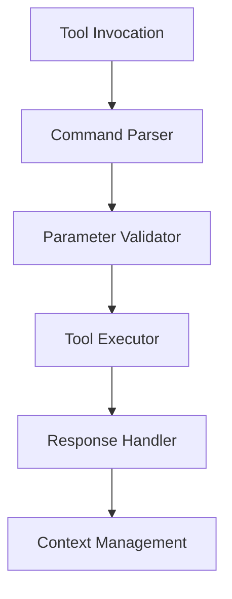

# Tool Invocation Architecture

Comprehensive guide to tool invocation patterns and implementation in local LLMs.

## Difficulty Level
Advanced

## Estimated Reading Time
45 minutes

{: .note }
Effective tool invocation is crucial for extending LLM capabilities and maintaining system reliability.

## Prerequisites
- [Tool Architecture](tool-architecture.md)
- [Advanced Architecture](architecture.md)
- [Token Management](token-management.md)

## Topics Covered
- Invocation patterns
- Command processing
- Error handling
- Resource management
- Performance optimization

## System Architecture



## Core Components

{: .content-card }
### Command Processing
```python
class CommandProcessor:
    def __init__(self):
        self.parsers = {}
        self.validators = {}
        
    def register_command(self, command_type, parser, validator):
        """Register new command type with parser and validator"""
        self.parsers[command_type] = parser
        self.validators[command_type] = validator
        
    def process_command(self, raw_command):
        """Process and validate command"""
        command_type = self._detect_command_type(raw_command)
        parsed_command = self.parsers[command_type](raw_command)
        return self.validators[command_type](parsed_command)
```

{: .tip }
Implement robust error handling for all tool invocations to prevent system failures.

## Tool Integration

### Integration Framework
```python
class ToolIntegration:
    def __init__(self):
        self.tools = {}
        self.middleware = []
        
    def register_tool(self, tool_name, handler):
        """Register tool with middleware support"""
        self.tools[tool_name] = self._wrap_with_middleware(handler)
        
    def _wrap_with_middleware(self, handler):
        """Apply middleware stack to tool handler"""
        wrapped = handler
        for middleware in reversed(self.middleware):
            wrapped = middleware(wrapped)
        return wrapped
```

## Resource Management

{: .content-card }
### Resource Control
1. Memory Management
   - Resource pooling
   - Cache control
   - Memory limits
   - Cleanup routines

2. Connection Management
   - Connection pooling
   - Timeout handling
   - Retry logic
   - Error recovery

## Performance Optimization

### Execution Pipeline
```python
class ExecutionPipeline:
    def __init__(self):
        self.stages = []
        self.metrics = PerformanceMetrics()
        
    def add_stage(self, stage):
        """Add processing stage to pipeline"""
        self.stages.append(stage)
        
    def execute(self, input_data):
        """Execute pipeline with performance tracking"""
        result = input_data
        for stage in self.stages:
            with self.metrics.track_stage(stage.name):
                result = stage.process(result)
        return result
```

## Error Handling

{: .content-card }
### Error Management
1. Validation Errors
   ```python
   class ValidationError(Exception):
       def __init__(self, message, details=None):
           super().__init__(message)
           self.details = details or {}
   ```

2. Runtime Errors
   ```python
   class ToolExecutionError(Exception):
       def __init__(self, tool_name, error_code, message):
           super().__init__(message)
           self.tool_name = tool_name
           self.error_code = error_code
   ```

## Monitoring and Metrics

### Performance Tracking
```python
class PerformanceMetrics:
    def __init__(self):
        self.metrics = {
            'invocation_count': 0,
            'error_rate': 0.0,
            'average_latency': 0.0,
            'success_rate': 0.0
        }
        
    def track_invocation(self, duration, success):
        """Track tool invocation metrics"""
        self.metrics['invocation_count'] += 1
        self._update_metrics(duration, success)
```

## Tool Categories

{: .content-card }
### System Tools
1. File Operations
   - Read/Write
   - Search
   - Modify
   - Delete

2. Process Management
   - Execution
   - Monitoring
   - Control
   - Cleanup

### Command Examples
```xml
<tool_invocation>
    <command>read_file</command>
    <parameters>
        <path>/path/to/file</path>
        <encoding>utf-8</encoding>
    </parameters>
</tool_invocation>
```

## Related Topics
- [Tool Architecture](tool-architecture.md)
- [Token Management](token-management.md)
- [Advanced Architecture](architecture.md)
- [Error Handling](advanced-troubleshooting.md)

## Technical Terms
- **Invocation Pattern**: Tool execution method
- **Command Processing**: Input handling
- **Resource Control**: Asset management
- **Error Recovery**: Failure handling

## Next Steps
1. [Advanced Architecture](architecture.md)
2. [Performance Optimization](hardware-optimization.md)
3. [Error Management](advanced-troubleshooting.md)