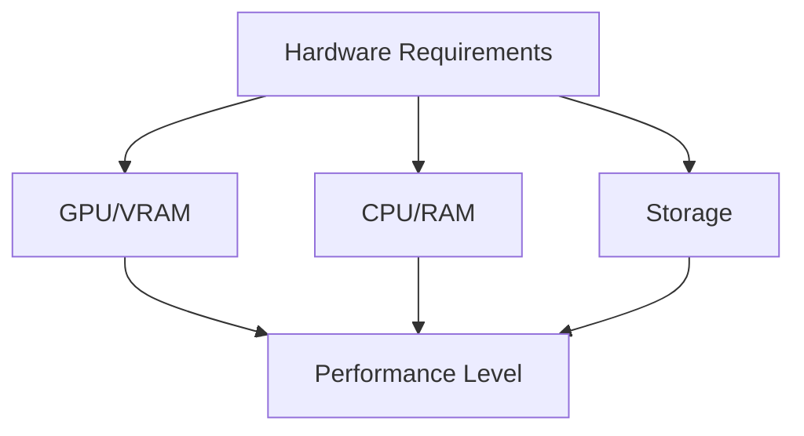

# Hardware Requirements

A comprehensive guide to the hardware needed for running local Large Language Models effectively.

## Difficulty Level
Quick-start

## Estimated Reading Time
20 minutes

{: .note }
Hardware requirements vary significantly based on your intended use case and model selection.

## Prerequisites
- [Quick Start Guide](local-llm-quick-path.md)

## Topics Covered
- GPU/VRAM requirements
- CPU specifications
- RAM and storage needs
- Performance expectations
- Quantization requirements

## Hardware Compatibility Matrix

{: .content-card }
| Hardware Tier   | VRAM    | Minimum Specs                                      | Recommended Specs                              | Performance Level      | Quantization Level   |
|-----------------|---------|----------------------------------------------------|------------------------------------------------|------------------------|----------------------|
| Basic/Testing   | 8GB     | RTX 3070 **or** Jetson Orin NX 8GB                | RTX 3080 **or** Jetson Orin NX 8GB            | Entry Level            | 4-bit/8-bit          |
| Development     | 16GB    | RTX 4080 **or** Jetson Orin NX 16GB               | RTX 4090                                       | Mid-Range              | 8-bit                |
| Production      | 32GB    | A5000 **or** Jetson AGX Orin 32GB                 | A6000 **or** Jetson AGX Orin 32GB             | High Performance       | No quantization      |
| Enterprise      | 64GB+   | High-end GPUs **or** Jetson AGX Orin 64GB         | Suitable for FP16 precision operation          | Maximum Performance    | FP16                 |

## System Architecture

## GPU Requirements

{: .tip }
Calculate required VRAM using this formula: Required VRAM = (model size) * 1.2

- Example calculations:
  - 7B model needs ~8.4GB VRAM minimum
  - 13B model needs ~15.6GB VRAM minimum
  - 33B model needs ~39.6GB VRAM minimum

## CPU Requirements

### Minimum Specifications
- 4 cores/8 threads
- 16GB RAM
- Recent generation (last 3-4 years)

### Recommended Specifications
- 8+ cores/16 threads
- 32GB RAM
- Current generation processor

## Storage Requirements

{: .content-card }
| Model Size | Minimum Space | Recommended Space | Cache Space |
|------------|---------------|-------------------|-------------|
| Small (7B) | 10GB         | 15GB              | +5GB        |
| Medium (13B) | 20GB       | 30GB              | +10GB       |
| Large (33B+) | 40GB+      | 60GB+             | +20GB       |

## Related Topics
- [Model Selection](model-selection.md) - Choosing compatible models
- [Hardware Optimization](../advanced/hardware-optimization.md) - Advanced setup
- [Token Management](../advanced/token-management.md) - Memory usage
- [Tool Usage](tool-usage.md) - Software requirements

## Technical Terms
- **VRAM**: Video RAM used for model loading
- **Quantization**: Model compression technique
- **PCIe**: System interconnect standard
- **NVMe**: Storage interface type

## Next Steps
1. [Model Selection](model-selection.md)
2. [Tool Usage Guide](tool-usage.md)
3. [Hardware Optimization](../advanced/hardware-optimization.md)