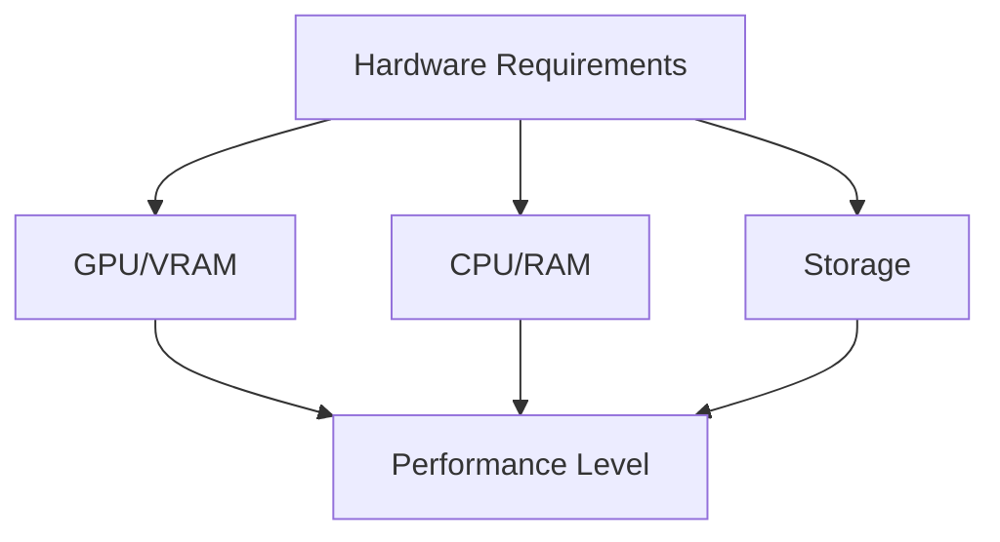

# Hardware Requirements

## Overview

This guide outlines the basic hardware requirements for running local LLMs. Understanding these requirements will help you choose the right setup for your needs.

## Basic Requirements

## GPU Requirements

### NVIDIA GPUs
| Model Size | Minimum VRAM | Recommended VRAM |
|------------|-------------|------------------|
| Small      | 8GB         | 12GB             |
| Medium     | 16GB        | 24GB             |
| Large      | 24GB        | 32GB+            |

### AMD GPUs
Limited support available. See [advanced hardware optimization](../advanced/hardware-optimization.md) for details.

## CPU Requirements

### Minimum Specifications
- 4 cores/8 threads
- 16GB RAM
- AVX2 support

### Recommended Specifications
- 8+ cores/16 threads
- 32GB RAM
- AVX512 support

## Storage Requirements

### Space Needed
- 10GB minimum for small models
- 20GB recommended for medium models
- 40GB+ for large models
- Extra space for caching

### Storage Type
- SSD recommended
- NVMe preferred for large models
- HDD not recommended

## Performance Levels

### Entry Level (8GB VRAM)
- Basic code completion
- Simple queries
- Limited tool usage

See [model selection](model-selection.md) for compatible models.

### Mid-Range (16GB VRAM)
- Full code generation
- Complex queries
- Standard tool usage

### High Performance (24GB+ VRAM)
- Multiple models
- Advanced features
- Full tool integration

## System Configuration

### BIOS Settings
- Enable virtualization
- Configure memory timings
- Set PCIe generation

### Operating System
- Latest Windows/Linux
- Updated drivers
- Proper configuration

## Performance Tips

Quick optimizations:
1. Close unnecessary programs
2. Update GPU drivers
3. Monitor temperatures
4. Manage background tasks

See [troubleshooting](troubleshooting.md) for performance issues.

## Upgrade Considerations

Signs you might need better hardware:
1. Slow responses
2. Memory errors
3. Model limitations
4. Performance issues

## Next Steps

After confirming hardware:
1. Choose your model
2. Install required tools
3. Begin basic setup

See [local LLM quick path](local-llm-quick-path.md) to get started.

## Advanced Topics

For detailed optimization:
- [Hardware Optimization](../advanced/hardware-optimization.md)
- [Model Tuning](../advanced/model-tuning.md)
- [Token Management](../advanced/token-management.md)

## See Also

- [Model Selection](model-selection.md) - Choosing compatible models
- [Tool Usage](tool-usage.md) - Setting up tools
- [Troubleshooting](troubleshooting.md) - Common issues
- [Quick Start Guide](local-llm-quick-path.md) - Getting started

## Technical Terms

See the [glossary](../reference/glossary.md) for explanations of:
- VRAM
- RAM
- PCIe
- NVMe
- Quantization