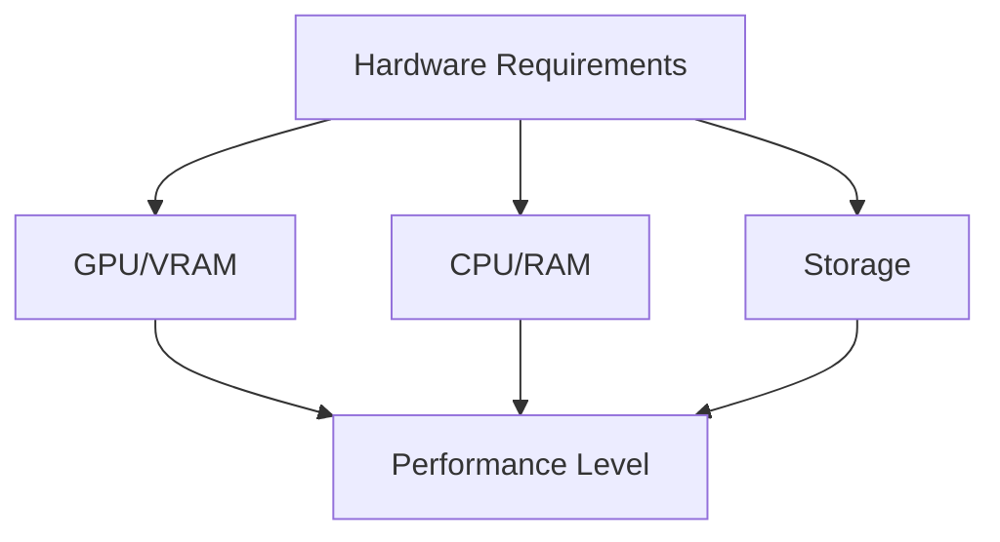

# Hardware Requirements

## Difficulty Level
Quick-start

## Estimated Reading Time
20 minutes

## Prerequisites
- [Quick Start Guide](local-llm-quick-path.md)

## Topics Covered
- GPU/VRAM requirements
- CPU specifications
- RAM and storage needs
- Performance expectations
- Quantization requirements

## Hardware Compatibility Matrix

| Hardware Tier   | VRAM    | Minimum Specs                                      | Recommended Specs                              | Performance Level      | Quantization Level   |
|-----------------|---------|----------------------------------------------------|------------------------------------------------|------------------------|----------------------|
| Basic/Testing   | 8GB     | RTX 3070 **or** Jetson Orin NX 8GB                 | RTX 3080 **or** Jetson Orin NX 8GB               | Entry Level            | 4-bit/8-bit          |
| Development     | 16GB    | RTX 4080 **or** Jetson Orin NX 16GB                | RTX 4090                                       | Mid-Range              | 8-bit                |
| Production      | 32GB    | A5000 **or** Jetson AGX Orin 32GB                  | A6000 **or** Jetson AGX Orin 32GB               | High Performance       | No quantization      |
| Enterprise      | 64GB+   | High-end GPUs **or** Jetson AGX Orin 64GB           | Suitable for FP16 precision operation          | Maximum Performance    | FP16                 |

## Basic Requirements

## GPU Requirements
- Required VRAM = (model size) * 1.2
- Example: 7B model needs ~8.4GB VRAM minimum

## CPU Requirements
- Minimum: 4 cores/8 threads, 16GB RAM
- Recommended: 8+ cores/16 threads, 32GB RAM

## Storage Requirements
- 10GB minimum for small models
- 20GB recommended for medium models
- 40GB+ for large models
- Extra space for caching

## Related Topics
- [Model Selection](model-selection.md) - Compatible models
- [Hardware Optimization](../advanced/hardware-optimization.md) - Advanced setup
- [Token Management](../advanced/token-management.md) - Memory usage
- [Tool Usage](tool-usage.md) - Software requirements

## Technical Terms
- VRAM - Video RAM for model loading
- Quantization - Model compression technique
- PCIe - System interconnect standard
- NVMe - Storage interface type

## Next Steps
1. [Model Selection](model-selection.md)
2. [Tool Usage Guide](tool-usage.md)
3. [Hardware Optimization](../advanced/hardware-optimization.md)
