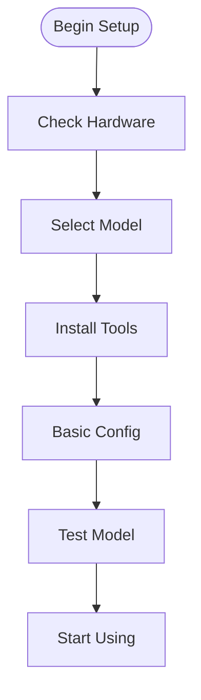

# Quick Start Guide: Local LLMs

## Overview

This guide provides a streamlined path to getting started with local LLMs. Follow these steps to quickly set up and start using your local language model.

## Quick Setup Steps



## 1. Check Your Hardware

Before starting, verify your system meets the minimum requirements:
- CPU/GPU specifications
- Memory requirements
- Storage space needed

See [hardware requirements](hardware-requirements.md) for detailed specifications.

## 2. Choose Your Model

Select a model based on your hardware:

### 8GB VRAM or Less
- Gemma 7B
- Phi-2
- Other small models

### 16GB VRAM
- CodeLlama 13B
- Mistral Small
- Medium-sized models

### 24GB+ VRAM
- Qwen 2.5 Coder
- DeepSeek 33B
- Large models

See [model selection](model-selection.md) for detailed comparisons.

## 3. Basic Setup

### Install Required Tools
```bash
# Example installation commands
curl -fsSL https://ollama.com/install.sh | sh
# Or other tool installations
```

For detailed tool setup, see [tool usage](tool-usage.md).

## 4. First Run

### Download Model
```bash
# Example with Ollama
ollama pull qwen2.5-coding

# Or for limited hardware
ollama pull gemma-7b
```

### Basic Test
Test your setup with a simple prompt:
```python
# Write a hello world program
```

## Common Issues

If you encounter problems:
1. Verify hardware requirements
2. Check model compatibility
3. Confirm tool installation
4. Review error messages

See [troubleshooting](troubleshooting.md) for solutions.

## Next Steps

After basic setup:
1. Explore model capabilities
2. Test different prompts
3. Try tool integrations
4. Optimize performance

## Advanced Topics

Ready to dive deeper? Check these advanced guides:
- [Architecture Deep Dive](../advanced/architecture.md)
- [Hardware Optimization](../advanced/hardware-optimization.md)
- [Model Tuning](../advanced/model-tuning.md)
- [Prompt Engineering](../advanced/prompt-engineering.md)

## See Also

- [Hardware Requirements](hardware-requirements.md) - Detailed system requirements
- [Model Selection](model-selection.md) - Choosing the right model
- [Tool Usage Guide](tool-usage.md) - Using LLM tools
- [Troubleshooting](troubleshooting.md) - Common issues and solutions

## Technical Terms

See the [glossary](../reference/glossary.md) for explanations of:
- VRAM
- Model Quantization
- Context Window
- Token Usage