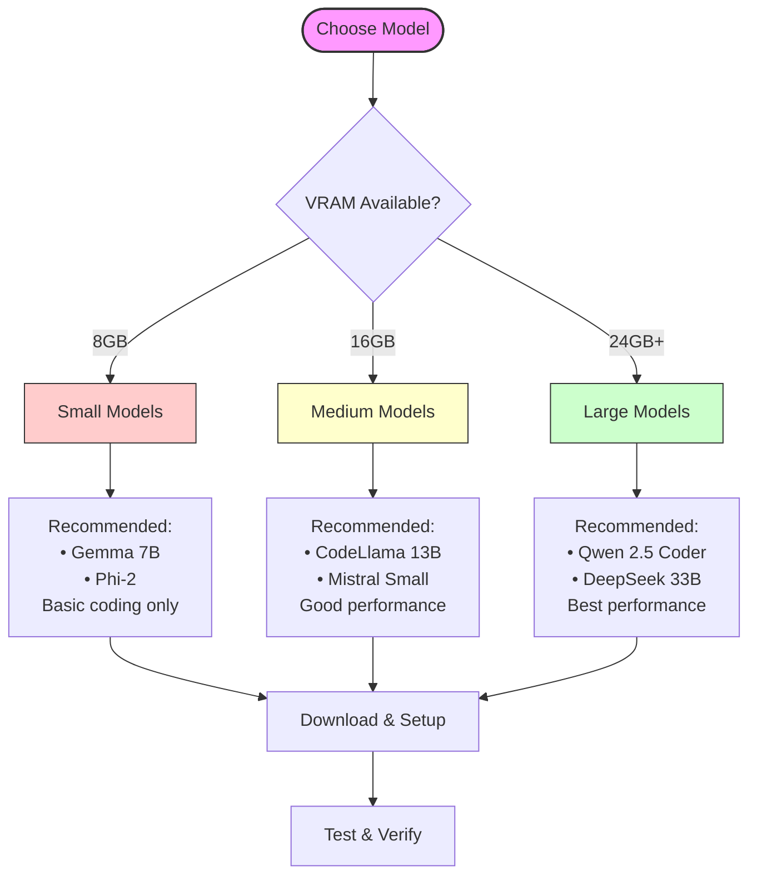

# Basic Model Selection Guide

Choose and set up the right local LLM model for your needs.



## Quick Model Recommendations

### Best Overall Models
1. **Qwen 2.5 Coder** (32B)
   - Excellent coding ability
   - Full tool support
   - Requires 24GB+ VRAM
   - Best with 8-bit quantization

2. **Mistral Small** (24B)
   - Good balance of size/performance
   - Reliable tool usage
   - Works with 16GB VRAM
   - Use GGUF quantization

3. **CodeLlama** (13B)
   - Good for basic to medium tasks
   - Works on mid-range hardware
   - Fits in 16GB VRAM
   - Wide compatibility

### For Limited Hardware (≤8GB VRAM)
1. **Gemma** (7B)
   - Basic code completion
   - Limited tool support
   - Fits in 8GB VRAM
   - Use 4-bit quantization

## Step-by-Step Model Setup

### 1. Download Model
Choose based on your LLM runner:

#### Ollama
```bash
# For best performance
ollama pull qwen2.5-coding

# For mid-range hardware
ollama pull mistral-small

# For limited hardware
ollama pull gemma-7b
```

#### LM Studio
1. Open LM Studio
2. Click "Download Models"
3. Search for recommended models
4. Choose appropriate quantization
5. Download and wait for completion

#### KoboldCpp
1. Visit [HuggingFace](https://huggingface.co)
2. Search for model in GGUF format
3. Download appropriate quantization
4. Place in models directory

### 2. Load Model

#### Ollama
```bash
ollama run qwen2.5-coding
# Or your chosen model
```

#### LM Studio
1. Click model in library
2. Click "Load Model"
3. Wait for completion
4. Enable API server

#### KoboldCpp
1. Launch KoboldCpp
2. Select model file
3. Choose settings
4. Click "Load Model"

### 3. Verify Model Works

Test with this simple prompt:
```python
# Write a function that calculates the factorial of a number
```

Expected behavior:
- Response within 5-10 seconds
- Complete, working function
- Proper documentation
- Error handling included

## Model Settings Guide

### Performance Settings

For detailed information on managing context windows and token usage, see [Token Management](../advanced/token-management.md).

| Setting | Small Models | Medium Models | Large Models |
|---------|--------------|---------------|--------------|
| Context | 8k tokens | 16k tokens | 32k tokens |
| Temp | 0.7 | 0.7 | 0.7 |
| Top P | 0.9 | 0.9 | 0.9 |

### Quantization Guide

| VRAM | Recommended | Fallback |
|------|-------------|----------|
| 8GB | 4-bit Q4_K_M | 3-bit Q3_K_L |
| 16GB | 8-bit Q8_0 | 4-bit Q4_K_M |
| 24GB+ | None/FP16 | 8-bit Q8_0 |

## Common Model Issues

### Slow Responses
- Lower context window
- Try different quantization
- Check CPU/GPU usage
- Close other applications

### Poor Code Quality
- Try larger model if possible
- Adjust temperature down
- Use more specific prompts (see [Prompt Engineering](../advanced/prompt-engineering.md) for techniques)
- Enable system prompts

### Out of Memory
- Use higher quantization
- Reduce context window
- Close other applications
- Try smaller model

## When to Upgrade Models

Consider upgrading when you see:
- Generic responses
- Poor tool usage
- Slow performance
- Limited understanding

## Next Steps

1. Test basic code completion
2. Try tool-using commands
3. Experiment with settings
4. Check Advanced Guide for optimization

For advanced usage optimization:
- See [Token Management](../advanced/token-management.md) for context window optimization
- See [Prompt Engineering](../advanced/prompt-engineering.md) for optimal prompting strategies

Need better performance? See [Hardware Requirements](hardware-requirements.md) for upgrade options.