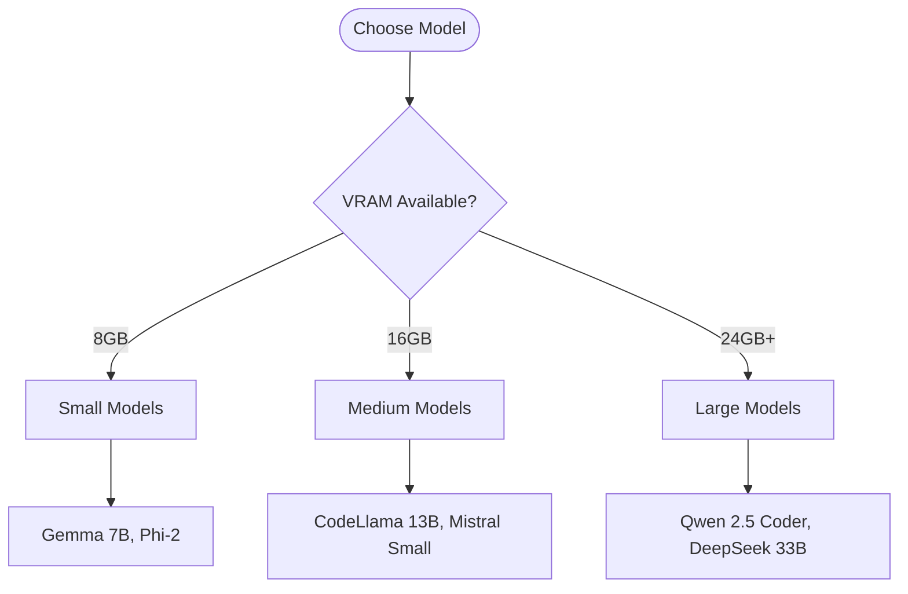

# Model Selection Guide

Learn how to choose the right model for your specific needs and hardware capabilities.

## Difficulty Level
Quick-start

## Estimated Reading Time
25 minutes

{: .note }
Selecting the right model is crucial for optimal performance and resource utilization.

## Prerequisites
- [Quick Start Guide](local-llm-quick-path.md)
- [Hardware Requirements](hardware-requirements.md)

## Topics Covered
- Model size considerations
- Hardware compatibility
- Performance expectations
- Quantization options
- Model setup steps

## Model Selection Flow

## Quick Model Recommendations

{: .content-card }
### Best Overall Models
1. **Qwen 2.5 Coder** (32B)
   - Excellent coding ability
   - Requires 24GB+ VRAM
   - Best for production use

2. **Mistral Small** (24B)
   - Good balance of size/performance
   - Works with 16GB VRAM
   - Suitable for development

3. **CodeLlama** (13B)
   - Good for basic to medium tasks
   - Works on mid-range hardware
   - Perfect for learning

{: .tip }
For systems with limited resources, start with Gemma 7B or Phi-2 to verify your setup before attempting larger models.

## Model Settings Guide

| Setting | Small Models | Medium Models | Large Models |
|---------|--------------|---------------|--------------|
| Context | 8k tokens | 16k tokens | 32k tokens |
| Temperature | 0.7 | 0.7 | 0.7 |
| Top P | 0.9 | 0.9 | 0.9 |
| Typical Memory | 8GB VRAM | 16GB VRAM | 24GB+ VRAM |

## Model Categories

### Development Models
- Best for: Active development, testing
- Size: 7B-13B parameters
- VRAM: 8-16GB
- Examples: Gemma 7B, CodeLlama 13B

### Production Models
- Best for: Professional use, deployment
- Size: 24B-33B parameters
- VRAM: 24GB+
- Examples: Qwen 2.5 Coder, DeepSeek 33B

## Related Topics
- [Hardware Requirements](hardware-requirements.md) - System needs
- [Token Management](../advanced/token-management.md) - Context handling
- [Model Tuning](../advanced/model-tuning.md) - Performance optimization
- [Tool Usage](tool-usage.md) - Setup instructions

## Technical Terms
- **Context Window**: Model's working memory size
- **Temperature**: Output randomness control
- **Top-P**: Token sampling parameter
- **Quantization**: Model compression method

## Next Steps
1. [Tool Usage Guide](tool-usage.md)
2. [Model Tuning](../advanced/model-tuning.md)
3. [Token Management](../advanced/token-management.md)