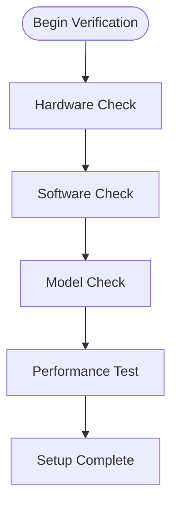

# Setup Verification Checklist

Ensure your local LLM setup is correctly configured and ready for use.

## Difficulty Level
Quick-start

## Estimated Reading Time
15 minutes

{: .note }
Complete each section in order to ensure a properly functioning setup.

## Prerequisites
- [Hardware Requirements](hardware-requirements.md)
- [Model Selection](model-selection.md)
- [Tool Usage](tool-usage.md)

## Verification Process

## Hardware Verification

{: .content-card }
### System Requirements
- [ ] CPU meets minimum specifications
- [ ] GPU is compatible and recognized
- [ ] Sufficient VRAM available
- [ ] Adequate storage space
- [ ] Required RAM available

## Software Configuration

{: .content-card }
### Driver and Dependencies
- [ ] GPU drivers up to date
- [ ] CUDA toolkit installed (if needed)
- [ ] Python environment configured
- [ ] Required packages installed

### Tool Installation
- [ ] LLM runner installed
- [ ] Configuration files present
- [ ] Permissions correctly set
- [ ] Path variables configured

## Model Verification

{: .tip }
Start with a smaller model for initial testing before moving to larger models.

### Download and Installation
- [ ] Model files downloaded completely
- [ ] Checksum verification passed
- [ ] Model loaded successfully
- [ ] Configuration validated

### Basic Testing
- [ ] Model initialization successful
- [ ] Memory usage within limits
- [ ] No error messages present
- [ ] Response generation working

## Performance Verification

### Basic Operations
- [ ] Simple prompt responses
- [ ] Context window functioning
- [ ] Tool integration working
- [ ] Memory management stable

### System Monitoring
- [ ] CPU usage normal
- [ ] GPU utilization appropriate
- [ ] Memory usage stable
- [ ] Temperature levels normal

## Related Topics
- [Model Tuning](../advanced/model-tuning.md)
- [Hardware Optimization](../advanced/hardware-optimization.md)
- [Advanced Troubleshooting](../advanced/advanced-troubleshooting.md)
- [Tool Architecture](../advanced/tool-architecture.md)

## Technical Terms
- **Checksum**: File verification code
- **CUDA**: NVIDIA's GPU computing platform
- **Context Window**: Model's text processing capacity
- **Quantization**: Model compression technique

## Next Steps
1. [Model Tuning](../advanced/model-tuning.md)
2. [Token Management](../advanced/token-management.md)
3. [Advanced Troubleshooting](../advanced/advanced-troubleshooting.md)