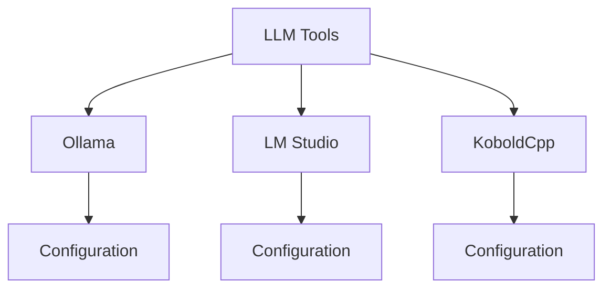

# Tool Usage Guide

## Difficulty Level
Quick-start

## Estimated Reading Time
20 minutes

## Prerequisites
- [Quick Start Guide](local-llm-quick-path.md)
- [Model Selection](model-selection.md)

## Topics Covered
- Tool installation
- Basic configuration
- API usage
- Model management
- Common operations



## Quick Setup

### Ollama
```bash
# Install
curl -fsSL https://ollama.com/install.sh | sh

# Pull model
ollama pull qwen2.5-coding

# Run
ollama run qwen2.5-coding
```

### API Integration
```python
POST /api/generate
{
    "prompt": "Your prompt here",
    "parameters": {
        "temperature": 0.7,
        "top_p": 0.9
    }
}
```

## Related Topics
- [Model Selection](model-selection.md) - Choosing models
- [Hardware Requirements](hardware-requirements.md) - System setup
- [Tool Architecture](../advanced/tool-architecture.md) - Advanced usage
- [Troubleshooting](troubleshooting.md) - Common issues

## Technical Terms
- API - Application Programming Interface
- WebSocket - Real-time communication protocol
- Temperature - Response randomness
- Context Length - Input/output size limit

## Next Steps
1. [Basic Troubleshooting](troubleshooting.md)
2. [Tool Architecture](../advanced/tool-architecture.md)
3. [Model Tuning](../advanced/model-tuning.md)