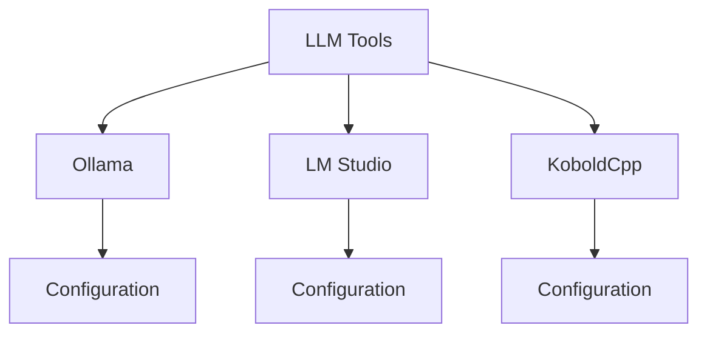

# Tool Usage Guide

Learn how to effectively use and configure various LLM tools and runners.

## Difficulty Level
Quick-start

## Estimated Reading Time
20 minutes

{: .note }
Different LLM runners have varying features and requirements. Choose based on your specific needs.

## Prerequisites
- [Quick Start Guide](local-llm-quick-path.md)
- [Model Selection](model-selection.md)

## Topics Covered
- Tool installation
- Basic configuration
- API usage
- Model management
- Common operations

## Tool Architecture Overview



## Quick Setup Guide

{: .content-card }
### Ollama
```bash
# Install
curl -fsSL https://ollama.com/install.sh | sh

# Pull model
ollama pull qwen2.5-coding

# Run
ollama run qwen2.5-coding
```

{: .tip }
Ollama provides the simplest setup process and is recommended for beginners.

## API Integration

### REST API Example
```python
import requests

response = requests.post('http://localhost:11434/api/generate',
    json={
        "model": "qwen2.5-coding",
        "prompt": "Write a hello world program",
        "parameters": {
            "temperature": 0.7,
            "top_p": 0.9
        }
    }
)
```

### WebSocket Example
```javascript
const ws = new WebSocket('ws://localhost:11434/api/generate')
ws.send(JSON.stringify({
    "model": "qwen2.5-coding",
    "prompt": "Write a hello world program"
}))
```

## Tool Comparison Matrix

| Feature | Ollama | LM Studio | KoboldCpp |
|---------|---------|------------|-----------|
| Installation | Single command | GUI installer | Manual setup |
| Interface | CLI + API | GUI + API | GUI + API |
| Model Management | Built-in | Manual | Manual |
| Performance | High | Medium | Very High |
| Ease of Use | Excellent | Good | Complex |

## Performance Optimization

{: .content-card }
### Memory Management
- Configure appropriate context sizes
- Use efficient quantization settings
- Monitor VRAM usage
- Implement proper cleanup

### Response Optimization
- Adjust temperature settings
- Fine-tune top-p and top-k
- Optimize prompt design
- Manage context effectively

## Related Topics
- [Model Selection](model-selection.md) - Choosing models
- [Hardware Requirements](hardware-requirements.md) - System setup
- [Tool Architecture](../advanced/tool-architecture.md) - Advanced usage
- [Troubleshooting](troubleshooting.md) - Common issues

## Technical Terms
- **API**: Application Programming Interface
- **WebSocket**: Real-time communication protocol
- **Temperature**: Response randomness control
- **Context Length**: Input/output size limit

## Next Steps
1. [Basic Troubleshooting](troubleshooting.md)
2. [Tool Architecture](../advanced/tool-architecture.md)
3. [Model Tuning](../advanced/model-tuning.md)