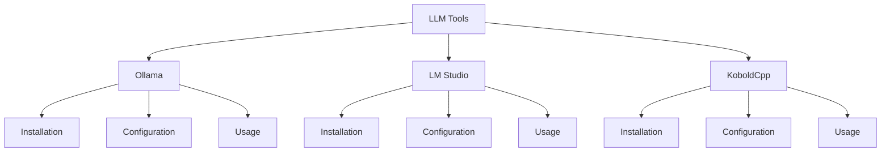

# Tool Usage Guide

## Overview

This guide covers basic tool usage for local LLMs. Learn how to set up and use common LLM tools for model interaction and management.

## Available Tools



## Quick Setup

### Ollama
```bash
# Install
curl -fsSL https://ollama.com/install.sh | sh

# Pull model
ollama pull qwen2.5-coding

# Run
ollama run qwen2.5-coding
```

### LM Studio
1. Download from website
2. Install application
3. Select model
4. Enable API server

### KoboldCpp
1. Download release
2. Extract files
3. Run executable
4. Load model

## Basic Usage

### Command Line Interface
```bash
# Basic prompt
ollama run qwen2.5-coding "Write a hello world program"

# With parameters
ollama run --system "You are a coding assistant" qwen2.5-coding
```

### GUI Interface
Common operations:
1. Model selection
2. Parameter adjustment
3. Prompt input
4. Response viewing

## Tool Features

### Model Management
- Download models
- Switch between models
- Update models
- Remove unused models

### Configuration Options
Basic settings:
1. Context length
2. Temperature
3. Top-P value
4. Response format

For advanced settings, see [model tuning](../advanced/model-tuning.md).

## API Integration

### REST API
Basic endpoints:
```python
POST /api/generate
{
    "prompt": "Your prompt here",
    "parameters": {
        "temperature": 0.7,
        "top_p": 0.9
    }
}
```

### WebSocket API
For streaming responses:
```javascript
ws://localhost:port/api/stream
```

## Common Operations

### Model Loading
1. Select model
2. Configure parameters
3. Initialize
4. Test response

### Prompt Engineering
Basic techniques:
1. Clear instructions
2. Context setting
3. Format specification
4. Examples

See [prompt engineering](../advanced/prompt-engineering.md) for advanced techniques.

## Performance Tips

### Optimization
1. Manage context length
2. Adjust parameters
3. Monitor resources
4. Cache responses

See [hardware optimization](../advanced/hardware-optimization.md) for details.

## Troubleshooting

Common tool issues:
1. Installation errors
2. Model loading failures
3. API connection problems
4. Response formatting

See [troubleshooting](troubleshooting.md) for solutions.

## Next Steps

After basic setup:
1. Experiment with prompts
2. Try different models
3. Explore API features
4. Optimize settings

## See Also

- [Model Selection](model-selection.md) - Choosing models
- [Hardware Requirements](hardware-requirements.md) - System setup
- [Quick Start Guide](local-llm-quick-path.md) - Getting started
- [Troubleshooting](troubleshooting.md) - Common issues

## Technical Terms

See the [glossary](../reference/glossary.md) for explanations of:
- API
- Context Length
- Temperature
- Top-P
- WebSocket