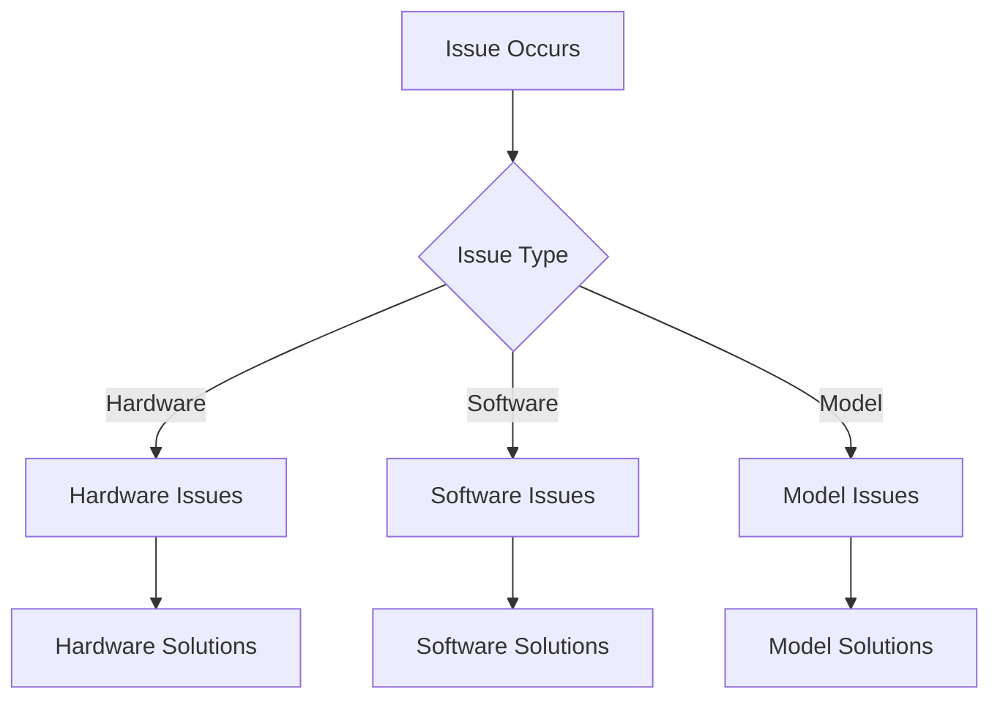

# Basic Troubleshooting Guide

## Overview

This guide helps resolve common issues when working with local LLMs. For more complex problems, see [advanced troubleshooting](../advanced/advanced-troubleshooting.md).

## Common Issues



## Hardware Problems

### Out of Memory
Common signs:
- Model fails to load
- System becomes unresponsive
- Error messages about memory

Solutions:
1. Close other applications
2. Try smaller model
3. Use quantization
4. Reduce context length

See [hardware requirements](hardware-requirements.md) for specifications.

### Performance Issues
Symptoms:
- Slow responses
- High CPU/GPU usage
- System lag

Quick fixes:
1. Update drivers
2. Check temperatures
3. Close background apps
4. Optimize settings

## Software Issues

### Installation Problems
Common errors:
1. Missing dependencies
2. Permission issues
3. Compatibility problems
4. Path errors

Solutions:
```bash
# Check permissions
sudo chmod +x ./install.sh

# Verify dependencies
python --version
nvidia-smi

# Clear cache
rm -rf ~/.cache/ollama
```

### Tool Issues
Problems with:
- API connections
- GUI interfaces
- Command line tools
- Model management

See [tool usage](tool-usage.md) for proper setup.

## Model Problems

### Loading Failures
Common issues:
1. Corrupt downloads
2. Incompatible formats
3. Missing files
4. Wrong configurations

Solutions:
1. Re-download model
2. Verify checksums
3. Check compatibility
4. Reset configurations

See [model selection](model-selection.md) for compatibility.

### Response Issues
Problems with:
- Poor quality outputs
- Incomplete responses
- Format errors
- Context confusion

Quick fixes:
1. Adjust parameters
2. Clear context
3. Rephrase prompt
4. Check token limits

## Quick Solutions

### First Steps
When an issue occurs:
1. Check error messages
2. Verify system resources
3. Review recent changes
4. Test basic functionality

### Basic Checks
```python
def basic_diagnostics():
    # Check system resources
    # Verify installations
    # Test connections
    # Validate configs
```

## Prevention Tips

### Regular Maintenance
1. Update software
2. Monitor resources
3. Clean cache
4. Test functionality

### Best Practices
- Regular backups
- Version control
- Resource monitoring
- Error logging

## When to Seek Help

Escalate when:
1. Basic fixes fail
2. System instability
3. Data loss risk
4. Critical failures

See [advanced troubleshooting](../advanced/advanced-troubleshooting.md) for complex issues.

## See Also

- [Hardware Requirements](hardware-requirements.md) - System specifications
- [Tool Usage](tool-usage.md) - Tool setup and usage
- [Model Selection](model-selection.md) - Model compatibility
- [Quick Start Guide](local-llm-quick-path.md) - Basic setup

## Technical Terms

See the [glossary](../reference/glossary.md) for explanations of:
- VRAM
- API
- Cache
- Quantization
- Context Window