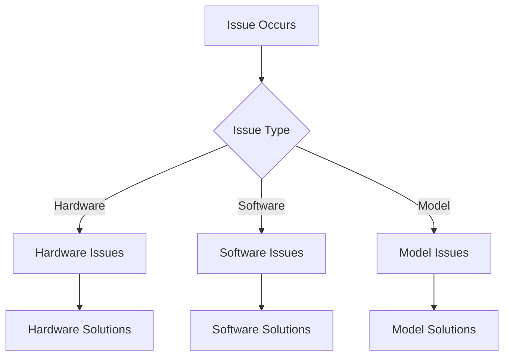

# Basic Troubleshooting Guide

## Difficulty Level
Quick-start

## Estimated Reading Time
15 minutes

## Prerequisites
- [Quick Start Guide](local-llm-quick-path.md)
- [Tool Usage](tool-usage.md)

## Topics Covered
- Common issues
- Basic diagnostics
- Quick solutions
- Prevention tips



## Common Issues and Solutions

### Out of Memory
- Close other applications
- Try smaller model
- Use quantization
- Reduce context length

### Installation Problems
```bash
# Check permissions
sudo chmod +x ./install.sh

# Verify dependencies
python --version
nvidia-smi
```

### Poor Code Quality
- Try larger model if possible
- Adjust temperature down
- Use more specific prompts
- Enable system prompts

## Related Topics
- [Hardware Requirements](hardware-requirements.md) - System specs
- [Model Selection](model-selection.md) - Model compatibility
- [Advanced Troubleshooting](../advanced/advanced-troubleshooting.md) - Complex issues
- [Hardware Optimization](../advanced/hardware-optimization.md) - Performance

## Technical Terms
- VRAM - Video memory
- API - Application interface
- Cache - Temporary storage
- Context Window - Model memory

## Next Steps
1. [Advanced Troubleshooting](../advanced/advanced-troubleshooting.md)
2. [Hardware Optimization](../advanced/hardware-optimization.md)
3. [Model Tuning](../advanced/model-tuning.md)