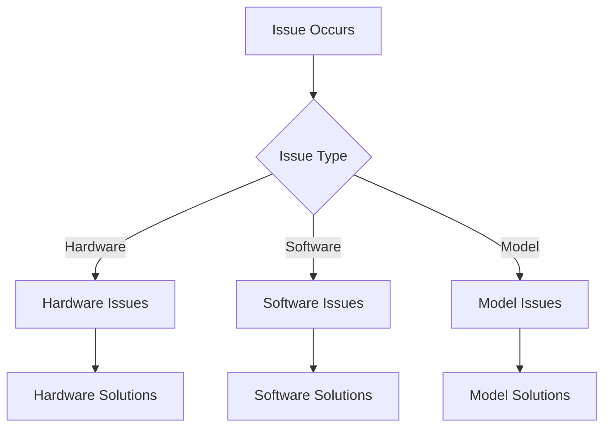

# Basic Troubleshooting Guide

Essential guidance for resolving common issues with local LLMs.

## Difficulty Level
Quick-start

## Estimated Reading Time
15 minutes

{: .note }
Most common issues can be resolved by following these troubleshooting steps systematically.

## Prerequisites
- [Quick Start Guide](local-llm-quick-path.md)
- [Tool Usage](tool-usage.md)

## Topics Covered
- Common issues
- Basic diagnostics
- Quick solutions
- Prevention tips

## Issue Resolution Flow



## Common Issues and Solutions

{: .content-card }
### Out of Memory Errors
1. Immediate Solutions:
   - Close unnecessary applications
   - Reduce model size
   - Enable quantization
   - Decrease context length

2. Long-term Solutions:
   - Upgrade GPU/VRAM
   - Optimize model settings
   - Implement better memory management

{: .tip }
Always monitor VRAM usage during model operation to prevent memory-related crashes.

## Installation Troubleshooting

### Permission Issues
```bash
# Fix permissions
sudo chmod +x ./install.sh

# Verify dependencies
python --version
nvidia-smi
```

### Dependency Verification
```bash
# Check CUDA installation
nvcc --version

# Verify Python packages
pip list | grep torch
pip list | grep transformers
```

## Model Performance Issues

{: .content-card }
### Poor Code Generation
1. Quality Improvements:
   - Use larger model if possible
   - Reduce temperature setting
   - Provide better context
   - Enable system prompts

2. Performance Optimization:
   - Adjust batch size
   - Optimize context window
   - Fine-tune parameters
   - Monitor resource usage

## Error Message Guide

| Error Type | Common Cause | Solution |
|------------|--------------|----------|
| CUDA Out of Memory | Insufficient VRAM | Reduce model size or batch size |
| API Connection Failed | Network/Port issues | Check network and firewall settings |
| Model Loading Error | Corrupt download | Re-download model files |
| Slow Response Time | Resource contention | Close other applications |

## Related Topics
- [Hardware Requirements](hardware-requirements.md) - System specifications
- [Model Selection](model-selection.md) - Model compatibility
- [Advanced Troubleshooting](../advanced/advanced-troubleshooting.md) - Complex issues
- [Hardware Optimization](../advanced/hardware-optimization.md) - Performance

## Technical Terms
- **VRAM**: Video memory for model operation
- **API**: Application programming interface
- **Cache**: Temporary data storage
- **Context Window**: Model's memory capacity

## Next Steps
1. [Advanced Troubleshooting](../advanced/advanced-troubleshooting.md)
2. [Hardware Optimization](../advanced/hardware-optimization.md)
3. [Model Tuning](../advanced/model-tuning.md)