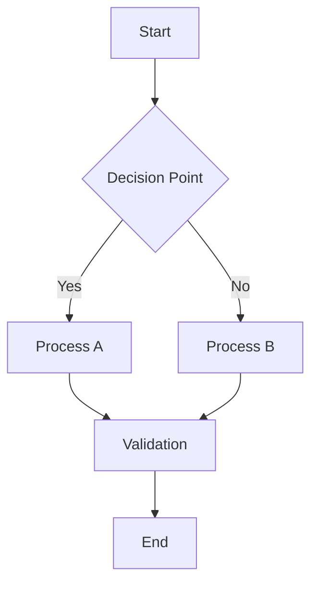
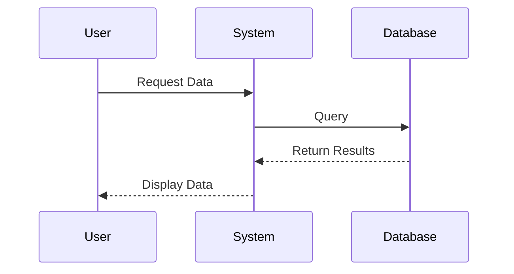
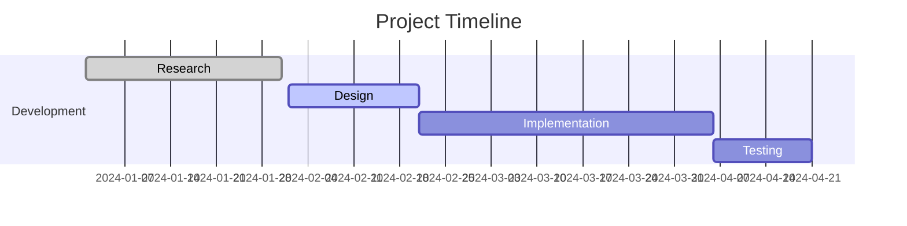
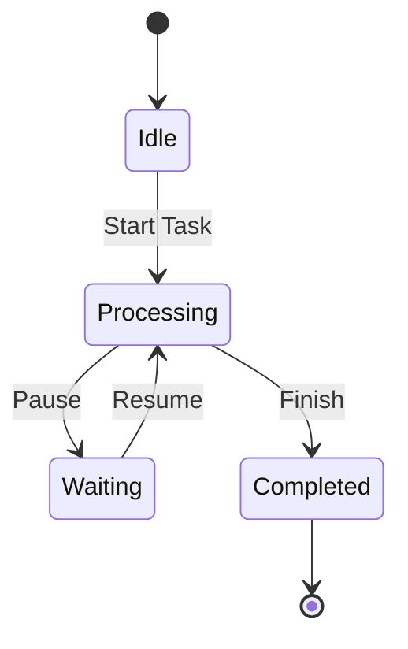

# Workflow Diagrams with Mermaid

## Simple Flowchart Example

```mermaid
graph TD
    A[Start] --> B{Decision Point}
    B -->|Yes| C[Process A]
    B -->|No| D[Process B]
    C --> E[Validation]
    D --> E
    E --> F[End]
```

## Sequence Diagram Example

```mermaid
sequenceDiagram
    participant User
    participant System
    participant Database
    
    User->>System: Request Data
    System->>Database: Query
    Database-->>System: Return Results
    System-->>User: Display Data
```

## Gantt Chart Example

```mermaid
gantt
    title Project Timeline
    dateFormat  YYYY-MM-DD
    section Development
    Research       :done,    des1, 2024-01-01, 30d
    Design         :active,  des2, 2024-02-01, 20d
    Implementation :         des3, after des2, 45d
    Testing        :         des4, after des3, 15d
```

## State Diagram Example

```mermaid
stateDiagram-v2
    [*] --> Idle
    Idle --> Processing : Start Task
    Processing --> Waiting : Pause
    Waiting --> Processing : Resume
    Processing --> Completed : Finish
    Completed --> [*]
```